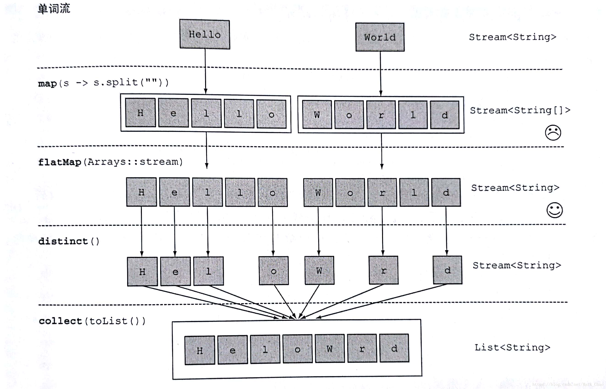

## Spring Boot Centos7软连启动

官方文档如下链接

https://docs.spring.io/spring-boot/docs/2.3.3.RELEASE/reference/htmlsingle/#deployment-initd-service

## docker compse安装
```shell script
curl -L https://get.daocloud.io/docker/compose/releases/download/1.25.0/docker-compose-`uname -s`-`uname -m` > /usr/local/bin/docker-compose;
chmod +x /usr/local/bin/docker-compose;
```

## JDK8-12新特性


## Java8 Stream中flatMap用法
在Java 8中，Stream可以容纳不同的数据类型，例如：
```text
Stream<String[]>
Stream<Set<String>>
Stream<List<String>>
Stream<List<Object>>
```
但是，Stream和collectors中的有些操作不能支持Stream中包含的复合类型，如`filter`、`sum`、`distinct`等，不能直接操作这些复合类型。
所以我们需要使用`flatMap()`（flat是水平的;平坦的;平滑的意思，用在这里就是把多层的数据结构变成单层(平的)数据结构）进行转换。
```text
Stream<String[]>　　　　->　　flatMap　　->　　Stream<String>
Stream<Set<String>>　　->　　flatMap　　->　　Stream<String>
Stream<List<String>>　　->　　flatMap　　->　　Stream<String>
Stream<List<Object>>　　->　　flatMap　　->　　Stream<Object>

#换成数据是下面这个样子
{{1,2}，{3,4}，{5,6}}  ->  flatMap  -> {1,2,3,4,5,6}
{'a'，'b'}，{'c'，'d'}，{'e'，'f'}}  -> flatMap  -> {'a'，'b'，'c' 'd'， 'e'， 'f'}
```
### 例子1
```java
String[][] data = new String[][]{{"a", "b"}, {"c", "d"}, {"e", "f"}};
//Stream<String[]>
Stream<String[]> temp = Arrays.stream(data);
//Stream<String>, GOOD!
Stream<String> stringStream = temp.flatMap(x -> Arrays.stream(x));
Stream<String> stream = stringStream.filter(x -> "a".equals(x.toString()));
stream.forEach(System.out::println);
```
### 例子2
```java
public class Student {
    private String name;
    private Set<String> book;
    public void addBook(String book) {
        if (this.book == null) {
            this.book = new HashSet<>();
        }
        this.book.add(book);
    }
    //getters and setters
}

Student obj1 = new Student();
obj1.setName("mkyong");
obj1.addBook("Java 8 in Action");
obj1.addBook("Spring Boot in Action");
obj1.addBook("Effective Java (2nd Edition)");
Student obj2 = new Student();
obj2.setName("zilap");
obj2.addBook("Learning Python, 5th Edition");
obj2.addBook("Effective Java (2nd Edition)");
List<Student> list = new ArrayList<>();
list.add(obj1);
list.add(obj2);
List<String> collect =
        list.stream()
                .map(x -> x.getBook())      //Stream<Set<String>>
                .flatMap(x -> x.stream())   //Stream<String>
                //去重
                .distinct()
                .collect(Collectors.toList());
collect.forEach(x -> System.out.println(x));
```
### 例子3
代码:
```java
String[] words = new String[]{"Hello","World"};
List<String> a = Arrays.stream(words)
        .map(word -> word.split(""))
        .flatMap(Arrays::stream)
        .distinct()
        .collect(toList());
a.forEach(System.out::print);
```
结果输出：HeloWrd

使用flatMap方法的效果是，各个数组并不是分别映射一个流，而是映射成流的内容，所有使用map(Array::stream)时生成的单个流被合并起来，即扁平化为一个流。

下图是运用flatMap的stream运行流程:


## SpringBoot获得Jar中的资源的方法

要获取`Jar`中的文件不能使用`ResourceUtils.getFile()`来获取文件，因为被打成了`Jar`文件。
只能通过流来获取。如下：

1. ClassPathResource
```java
ClassPathResource resource = new ClassPathResource("videoToM3u8.lua");
InputStream stream = resource.getInputStream();
```

2. ResourceLoader
```java
ResourceLoader loader = new DefaultResourceLoader();
Resource res = loader.getResource("classpath:videoToM3u8.lua");
InputStream inputStream = res.getInputStream();
```