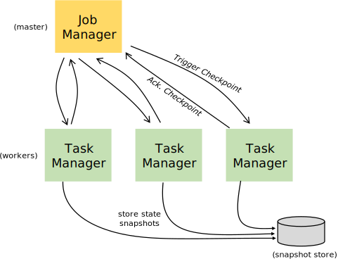

<div style="text-align: center;"><b>Flink1.9.2介绍</b></div>

## 创建Flink Maven工程
```shell script
mvn archetype:generate \
  -DarchetypeGroupId=org.apache.flink \
  -DarchetypeArtifactId=flink-quickstart-java \
  -DarchetypeVersion=1.10.0
```

## Flink组件栈

Flink是一个分层架构的系统，每一层所包含的组件都提供了特定的抽象，用来服务于上层组件。Flink分层的组件栈如下图所示：


## Flink的组件抽象层次

Flink提供了不同级别的抽象来开发流/批处理应用程序。


* 最底层的抽象只是提供有状态的流。它通过`Process`函数嵌入到`DataStream API`中。它允许用户自由处理来自一个或多个流的事件，并使用一致的容错状态。此外，用户可以注册事件时间和处理时间回调，允许程序实现复杂的计算。
* 实际上，大多数应用程序不需要上述的低级抽象，而是根据核心`APIs`（如`DataStream API`（有界/无界流）和`DataSet API`（有界数据集））进行编程。这些`fluent api`为数据处理提供了通用的构建块，如各种形式的用户指定的转换、连接、聚合、窗口、状态等。在这些api中处理的数据类型用相应的编程语言表示为类。
  
  低级流程功能与`DataStream API`集成，使得只对某些操作进行低级抽象成为可能。`DataSet API`在有界数据集上提供了额外的原语，比如循环/迭代。
  
* `Table API`是一个以表为中心的声明性`DSL`，它可以动态地改变表（当表示流时）。表`API`遵循（扩展的）关系模型：表附加了一个模式（类似于关系数据库中的表），并且`API`提供类似的操作，例如`select`、`project`、`join`、`group by`、`aggregate`等。表`API`程序声明性地定义应该执行的逻辑操作，而不是确切地指定代码的方式为手术做准备。尽管`Table API`可以通过各种类型的用户定义函数进行扩展，但它的表现力不如核心`API`，但使用起来更简洁（编写的代码更少）。此外，`Table API`程序也会在执行之前通过应用优化规则的优化器。
  
   可以在表和数据流/数据集之间无缝地转换，允许程序将表API与数据流和数据集API混合。
* `Flink`提供的最高级别抽象是`SQL`。这个抽象在语义和表示性上都类似于`Table API`，但它将程序表示为`SQL`查询表达式。`SQL`抽象与`Table API`紧密交互，`SQL`查询可以在`Table API`中定义的表上执行。


低级流程功能与DataStream API集成，使得只对某些操作进行低级抽象成为可能。DataSet API在有界数据集上提供了额外的原语，比如循环/迭代。

## Flink的Job Managers、Task Managers、客户端（Clients）

## 程序和数据流

## Flink中Task Slots和资源
每个 worker（TaskManager）都是一个 JVM 进程，并且可以在不同的线程中执行一个或多个 subtasks。为了控制 worker 接收 task 的数量，worker 拥有所谓的 task slots （至少一个）。

每个 task slots 代表 TaskManager 的一份固定资源子集。例如，具有三个 slots 的 TaskManager 会将其管理的内存资源分成三等份给每个 slot。 划分资源意味着 subtask 之间不会竞争资源，但是也意味着它们只拥有固定的资源。注意这里并没有 CPU 隔离，当前 slots 之间只是划分任务的内存资源。

通过调整 slot 的数量，用户可以决定 subtasks 的隔离方式。每个 TaskManager 有一个 slot 意味着每组 task 在一个单独的 JVM 中运行（例如，在一个单独的容器中启动）。拥有多个 slots 意味着多个 subtasks 共享同一个 JVM。 Tasks 在同一个 JVM 中共享 TCP 连接（通过多路复用技术）和心跳信息（heartbeat messages）。它们还可能共享数据集和数据结构，从而降低每个 task 的开销。

## Flink安装
### 单机安装
直接下载解压运行bin目录中的start-filk.sh就可以了。然后访问http://localhost:8081可以看到flink的web界面就能看到了。
### 集群模式安装（不集成hadoop）
1. 配置conf目录下的flink-conf.yaml文件，如下：
    ```yaml
    # The external address of the host on which the JobManager runs and can be
    # reached by the TaskManagers and any clients which want to connect. This setting
    # is only used in Standalone mode and may be overwritten on the JobManager side
    # by specifying the --host <hostname> parameter of the bin/jobmanager.sh executable.
    # In high availability mode, if you use the bin/start-cluster.sh script and setup
    # the conf/masters file, this will be taken care of automatically. Yarn/Mesos
    # automatically configure the host name based on the hostname of the node where the
    # JobManager runs.
    # Job Manager的RPC地址
    jobmanager.rpc.address: localhost
     
    # The RPC port where the JobManager is reachable.
    # RPC端口
    jobmanager.rpc.port: 6123
    
    # The heap size for the JobManager JVM 
    # Jom Manager的JVM堆内存
    jobmanager.heap.size: 1024m
    
    # The heap size for the TaskManager JVM
    # Task Manager的堆内存
    taskmanager.heap.size: 1024m
    
    # The number of task slots that each TaskManager offers. Each slot runs one parallel pipeline.
    # Task Manager的槽的数量
    taskmanager.numberOfTaskSlots: 1
    
    # The parallelism used for programs that did not specify and other parallelism.
    # 并行处理数
    parallelism.default: 1
    ```
2. 配置slaves文件
把所有从节点的hostname配置到slaves文件中，然后拷贝配置信息到所有节点，（主从直接配置了ssh免密）
3. 进入bin目录启动Flink就可以了。

## 运行Flink程序
### Web界面提交
本次选择Flink自带的例子里面的`SocketWindowWordCount.jar`，提交完成如下：

1. 配置`1`是并行度，不能超过配置文件配置的数量(如果是本地运行并行数量给机器的CPU核数有关)
2. `--hostname localhost --port 8888`配置读取数据的地址和端口。
3. 然后我们使用`nc -lk 8888`在本机启动一个`Socket`服务。这个时候我就可以点击【Submit】提交了。
4. 我们在`nc`中输入以空格分隔的多个单词然后回车。就可以在`Task Managers`的`Stdout`中看到统计数据的输出了。
### 命令行运行

使用命令行提交任务：
```shell script
bin/flink run -m localhost:8081 -p 1 \
 -c org.apache.flink.streaming.examples.socket.SocketWindowWordCount \
 /jar \  #指定jar文件位置
 --hostname localhost --port 8888
```

参数说明:
 * -m指定主机名后面的端口为 JobManager的REST的端口,而不是RPC的端口,RPC通信端口是6123
 * -p指定是并行度
 * -c指定main方法的全类名

## Flink数据模型


`Flink`提供了不同级别的编程抽象,通过调用抽象的数据集调用算子构建 `Data flow`就可以实现对分布式的数据进行流式计算和离线计算, 
**`DataSet`是批处理的抽象数据集, `DataStream`是流式计算的抽象数据集**,他们的方法都分别为 `Source`、 `Transformation`、`Sink`

* `Source`主要负责数据的读取
* `Transformation`主要负责对数据的转换操作
* `Sink`负责最终计算好的结果数据输出

## Flink中的算子

## Flink中的Event Time和Watermark
[Flink -- Watermark 那些事](https://www.jianshu.com/p/94c3865666fa)

## Flink容错

### State(状态)

`Flink`实时计算程序为了保证计算过程中,出现异常可以容错.就要将中间的计算结果数据存储起来这些中间数据就叫做`State`。

`State`可以是多种类型的,默认是保存在 `JobManager`的内存中,也可以保存到 `TaskManager`本地文件系统或`HDFS`这样的分布式文件系统。

### StateBackEnd

用来保存 `State`的存储后端就叫做 `State Backend`,默认是保存在 `JobManager`的内存中,也可以保存的本地文件系统或`HDFS`这样的分布式文件系统。

### CheckPointing

`Flink`实时计算为了容错,可以将中间数据定期保存到起来,这种定期触发保存中间结果的机制叫`Checkpointing`. `Checkpointing`是周期执行的。具体的过程是 `JobManager`定期的向 `TaskManager`中的`SubTask`发送`RPC`消息, `SubTask`将其计算的 `State`保存到 `StateBackEnd`中,并且向 `JobManager`响应`Checkpoint`是否成功.如果程序出现异常或重启, `TaskManager`中的 `SubTask`可以从上一次成功的`CheckPointing`的 `State`恢复。



### 重启策略

`Flink`实时计算程序,为了容错,需要开启 `Checkpointing`，一旦开启 `Checkpointing`，如果没有重启策略,默认的重启策略是无限重启，也可以设置其他重启策略，比如重启固定次数且可以延迟执行的策略。

#### 如何开启重启策略

只有开启了Checkpointing，才会开启重启策略。默认的重启策略是，固定延迟重启次数是`Integer.MAX_VALUE`次。

```java
StreamExecutionEnvironment env = StreamExecutionEnvironment.getExecutionEnvironment();

//开启Checkpointing，5秒发送一次保存State命令
env.enableCheckpointing(5000);

//更改重启策略，设置对多重启3次，每次延迟2秒。
env.getConfig().setRestartStrategy(RestartStrategies.fixedDelayRestart(3,2000));
```


