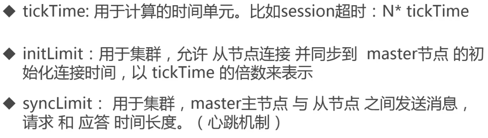

## hbase1.4.12安装配置
### 使用自带的zookeeper安装配置
#### 拷贝依赖的hadoop配置文件
把`hbase`所依赖的`hadoop`配置文件拷贝到`hbase`的`conf`目录，分别是`core-site.xml`和`hdfs-site.xml`。
#### 配置hbase-env.sh
1. 配置JDK环境变量，`export JAVA_HOME=/usr/loal/jdk8/`
2. 注释掉设置JVM永生带的参数。
    ```shell script
    export HBASE_MASTER_OPTS="$HBASE_MASTER_OPTS -XX:PermSize=128m -XX:MaxPermSize=128m -XX:ReservedCodeCacheSize=256m"
    export HBASE_REGIONSERVER_OPTS="$HBASE_REGIONSERVER_OPTS -XX:PermSize=128m -XX:MaxPermSize=128m -XX:ReservedCodeCacheSize=256m"
    ```
3. 配置独立Zookeeper参数
```shell script
# export HBASE_MANAGES_ZK=true
```
改参数是配置是否使用独立Zookeeper的参数。
#### 配置hbase-site.xml
添加如下xml配置：
```xml
<configuration>
 <!-- hbase数据存放位置，可以是一个普通的文件夹例如：file:///home/vagrant/hbase，这里设置的是hdfs路径 -->
  <property>
    <name>hbase.rootdir</name>
    <value>hdfs://hadoop2:9000/hbase</value>
  </property>
  <!-- hbase依赖的zookeeper文件存放路径，hbase内置zk使用 -->
  <property>
    <name>hbase.zookeeper.property.dataDir</name>
    <value>/home/vagrant/bigdata/hbase/zookeeper</value>
  </property>
  <!-- 集群运行模式，是否以集群方式运行，true表示，是，虽然只有一个节点，但是也可以使用集群方式运行 -->
  <property>
    <name>hbase.cluster.distributed</name>
    <value>true</value>
  </property>
</configuration>
```
#### 运行和测试hbase是否安装完成
进入`hbase`的`bin`目录执行`./start-hbase.sh`，等待启动完成，然后执行`jps`查看`hbase`的进程是否都已经启动，使用`./hbase shell`进入`hbase`的命令行中，执行`status`名称查看`hbase`状态。
### 配置独立zookeeper
#### 修改hbase-env.sh文件
把`export HBASE_MANAGES_ZK=true`设置为false
#### 配置hbase-site.xml
添加如下配置：
```xml
<property>
    <name>hbase.zookeeper.quorum</name>
    <value>hadoop2</value>
</property>
<property>
    <name>hbase.zookeeper.property.clientPort</name>
    <value>2181</value>
</property>
```
### 独立zookeeper安装配置
下载zookeeper
#### zookeeper安装配置
解压zookeeper到指定目录，进入zookeeper目录
1. 配置`zoo.cfg`文件
进入zookeeper目录下的`conf`目录，复制`zoo_sample.cfg`为`zoo.cfg`文件
`cp zoo_sample.cfg zoo.cfg`。
2. `vi`编辑zoo.cfg文件
修改dataDir配置到自己指定位置，在这里我配置成:<br/>
1). dataDir=/home/vagrant/bigdata/zookeeper 必须配置Zookeeper数据存储目录<br/>
3). dataLogDir 配置日志存放目录，如果不配置和dataDir共用一个目录<br/>
4). tickTime=2000为基础时间 ticktime:用于计算的时间单元。比如 session超时:N* ticktime<br/>
5). clientPort=2181为zookeeper的端口号

    

3. 配置zookeeper home
```shell script
export ZOOKEEPER_HOME=/home/vagrant/bigdata/zookeeper-3.5.6
export HADOOP_MAPRED_HOME=/home/vagrant/bigdata/hadoop-3.2.1
export PATH=$PATH:$ZOOKEEPER_HOME/bin
```
> 完成上配置单机版的zookeeper就配置完成了！

##### 启动zookeeper
1. 进入zookeeper的bin目录，执行`./zkServer.sh start`，然后执行`./zkServer.sh status`查看启动状态。
2. 启动完成后使用`./zkCli.sh`命令行进入zookeeper的交互式命令行。
3. 执行help命令查看zookeeper中支持的所有命令，使用ls /查看根下的节点
##### zookeeper基本数据模型
1. zookeeper是一个树状结构来组织数据的，根是以斜杠开始(`/`)类似与Linux的目录结构。每一个节点可以包含子节点和数据。
2. 每一个节点都称之为 znode,它可以有子节点,也可以有数据
3. 每个节点分为临时节点和永久节点,临时节点在客户端断开后消失
4. 每个zk节点都各自的版本号,可以通过命令行来显示节点信息
5. 每当节点数据发生变化,那么该节点的版本号会累加(乐观锁)
6. 删除/修改过时节点,版本号不匹配则会报错
7. 每个水k节点存储的数据不宜过大,几K即可
8. 节点可以设置权限acl,可以通过权限来限制用户的访问

### phoeninx安装配置
解压对于版本的`phoeninx`，并拷贝`phoenix core`和`phoeix server`的`jar`文件到`hbase`的`lib`目录下，如果是`hbase`集群需要拷贝到所有集群节点上。
我安装的`hbase`对于的`jar`文件是如下两个文件：
1. `phoenix-core-4.15.0-HBase-1.4.jar`
2. `phoenix-4.15.0-HBase-1.4-server.jar`
到此`phoenix`和`hbase`就算集成完成了。然后重启`hbase`。
#### 测试集成效果
进入`phoenix`解压的`bin`目录，执行`./sqlline.py hadoop2:2181`，进入`phoenix`命令行，使用`help`查看支持的所有命令，使用`!tables`查看所有的表，可以看到所有的表。
