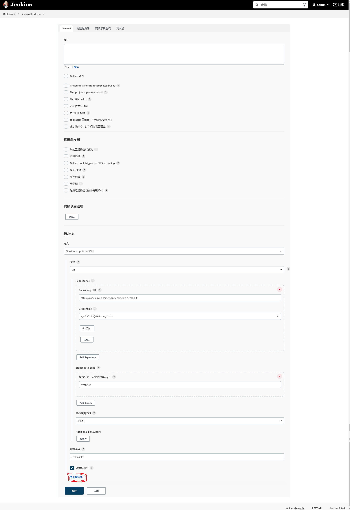

# jenkins 错误

`Jenkins`通过`shell`脚本调用`mvn`命令的时候，是从`/usr/bin`文件夹中找命令的，这个时候需要做个软链接
```shell
ln -s /opt/apache-maven-3.6.2/bin/mvn /usr/bin/mvn
```
这样设置后就不会出现`mvn command not found`的问题了

# 需要的插件

## Git plugin
clone代码到本地
```shell
checkout([$class: 'GitSCM', 
  branches: [[name: '*/master']], 
  extensions: [], 
  userRemoteConfigs: [[
        credentialsId: '0b3d077d-bc68-495c-88aa-dd299de59940', 
        url: 'https://code.aliyun.com/v5cn/jenkinsfile-demo.git'
    ]]]
  )
```

## Publish Over SSH
可以复制文件到远程机器上
```shell
sshPublisher(publishers: [sshPublisherDesc(configName: '154-dev', transfers: [
    sshTransfer(
         cleanRemote: false,
         excludes: '',
         execCommand: '',
         execTimeout: 120000,
         flatten: false,
         makeEmptyDirs: false,
         noDefaultExcludes: false,
         patternSeparator: '[, ]+',
         remoteDirectory: '/mnt/jenkinsfile-demo',
         remoteDirectorySDF: false,
         removePrefix: 'docker',
         sourceFiles: 'docker/Dockerfile'),
    
    sshTransfer(
        cleanRemote: false,
        excludes: '',
        execCommand:
            '''
            cd /mnt/jenkinsfile-demo;ls -all;
            docker rmi -f jenkinsfile-demo;
            docker build -t jenkinsfile-demo .;
            date;
            oldInstances=$(docker ps -a |grep -i jenkinsfile-demo|wc -l);
            if docker ps -a |grep -i jenkinsfile-demo;then
    
              echo  hase $oldInstances Instances.
            fi
    
            docker rm -f jenkinsfile-demo;
            docker run  -v /etc/localtime:/etc/localtime  \\
             --restart=on-failure:10 \\
             -e "JAVA_OPTS=-Xms256m -Xmx256m" \\
              -p 9191:8080 --name jenkinsfile-demo   -d jenkinsfile-demo;
    
            docker ps;
            ''',
        execTimeout: 120000,
        flatten: false,
        makeEmptyDirs: false,
        noDefaultExcludes: false,
        patternSeparator: '[, ]+',
        remoteDirectory: '/mnt/jenkinsfile-demo',
        remoteDirectorySDF: false,
        removePrefix: '',
        sourceFiles: 'target/*.jar')],
    usePromotionTimestamp: false,
    useWorkspaceInPromotion: false,
    verbose: false)])
```
## SSH Pipeline Steps
sshCommand: SSH Steps: sshCommand - 在远程节点上执行命令。
```shell
stage('Remote SSH') {
    steps {
        script {
            echo 'Remote SSH start --------------------------'
            # 定义远程节点
            def remote = [:]
            remote['name'] = 'dev'
            remote['host'] = '192.168.1.154'
            remote['user'] = 'root'
            remote['password'] = 'Powertime154#'
            remote['allowAnyHosts'] = true

            # 执行命令到远程
            sshCommand(remote: remote, command: "mkdir /opt/ddddd")

            echo "Remote SSH end ---------------------------------"
        }
    }
}
```

# jenkins v1
```shell
pipeline {
    agent any

    stages {
        stage('Pull code') {
            steps {
                checkout([$class: 'GitSCM', branches: [[name: '*/master']], extensions: [], userRemoteConfigs: [[credentialsId: '0b3d077d-bc68-495c-88aa-dd299de59940', url: 'https://code.aliyun.com/v5cn/jenkinsfile-demo.git']]])
            }
        }

        stage('Build project') {
            steps {
                sh "mvn -Dmaven.test.failure.ignore=true clean package"
            }
        }

        stage('Publish project') {
            steps {
                sshPublisher(publishers: [sshPublisherDesc(configName: '154-dev', transfers: [
                sshTransfer(
                     cleanRemote: false,
                     excludes: '',
                     execCommand: '',
                     execTimeout: 120000,
                     flatten: false,
                     makeEmptyDirs: false,
                     noDefaultExcludes: false,
                     patternSeparator: '[, ]+',
                     remoteDirectory: '/mnt/jenkinsfile-demo',
                     remoteDirectorySDF: false,
                     removePrefix: 'docker',
                     sourceFiles: 'docker/Dockerfile'),

                sshTransfer(
                    cleanRemote: false,
                    excludes: '',
                    execCommand:
                        '''
                        cd /mnt/jenkinsfile-demo;ls -all;
                        docker rmi -f jenkinsfile-demo;
                        docker build -t jenkinsfile-demo .;
                        date;
                        oldInstances=$(docker ps -a |grep -i jenkinsfile-demo|wc -l);
                        if docker ps -a |grep -i jenkinsfile-demo;then

                          echo  hase $oldInstances Instances.
                        fi

                        docker rm -f jenkinsfile-demo;
                        docker run  -v /etc/localtime:/etc/localtime  \\
                         --restart=on-failure:10 \\
                         -e "JAVA_OPTS=-Xms256m -Xmx256m" \\
                          -p 9191:8080 --name jenkinsfile-demo   -d jenkinsfile-demo;

                        docker ps;
                        ''',
                    execTimeout: 120000,
                    flatten: false,
                    makeEmptyDirs: false,
                    noDefaultExcludes: false,
                    patternSeparator: '[, ]+',
                    remoteDirectory: '/mnt/jenkinsfile-demo',
                    remoteDirectorySDF: false,
                    removePrefix: '',
                    sourceFiles: 'target/*.jar')],
                usePromotionTimestamp: false,
                useWorkspaceInPromotion: false,
                verbose: false)])
            }
        }
    }
}
```

# jenkins v2
```shell
#!/usr/bin/env groovy
pipeline {
    agent any

    stages {
        stage('Pull code') {
            steps {
                checkout([$class: 'GitSCM', branches: [[name: '*/master']], extensions: [], userRemoteConfigs: [[credentialsId: '0b3d077d-bc68-495c-88aa-dd299de59940', url: 'https://code.aliyun.com/v5cn/jenkinsfile-demo.git']]])
            }
        }

        stage('Build project') {
            steps {
                sh "mvn -Dmaven.test.failure.ignore=true clean package"
            }
        }

        stage('Remote SSH') {
            steps {
                script {
                    echo 'Remote SSH start --------------------------'
                    def remote = [:]
                    remote['name'] = 'dev'
                    remote['host'] = '192.168.1.154'
                    remote['user'] = 'root'
                    remote['password'] = 'Powertime154#'
                    remote['allowAnyHosts'] = true


                    sshCommand(remote: remote, command: "mkdir /opt/ddddd")

                    echo "Remote SSH end ---------------------------------"
                }
            }
        }

        stage('Publish project') {
            steps {
                sshPublisher(publishers: [sshPublisherDesc(configName: '154-dev', transfers: [
                sshTransfer(
                     cleanRemote: false,
                     excludes: '',
                     execCommand: '',
                     execTimeout: 120000,
                     flatten: false,
                     makeEmptyDirs: false,
                     noDefaultExcludes: false,
                     patternSeparator: '[, ]+',
                     remoteDirectory: '/mnt/jenkinsfile-demo',
                     remoteDirectorySDF: false,
                     removePrefix: 'docker',
                     sourceFiles: 'docker/Dockerfile'),

                sshTransfer(
                    cleanRemote: false,
                    excludes: '',
                    execCommand:
                        '''
                        cd /mnt/jenkinsfile-demo;ls -all;
                        docker rmi -f jenkinsfile-demo;
                        docker build -t jenkinsfile-demo .;
                        date;
                        oldInstances=$(docker ps -a |grep -i jenkinsfile-demo|wc -l);
                        if docker ps -a |grep -i jenkinsfile-demo;then

                          echo  hase $oldInstances Instances.
                        fi

                        docker rm -f jenkinsfile-demo;
                        docker run  -v /etc/localtime:/etc/localtime  \\
                         --restart=on-failure:10 \\
                         -e "JAVA_OPTS=-Xms256m -Xmx256m" \\
                          -p 9191:8080 --name jenkinsfile-demo   -d jenkinsfile-demo;

                        docker ps;
                        ''',
                    execTimeout: 120000,
                    flatten: false,
                    makeEmptyDirs: false,
                    noDefaultExcludes: false,
                    patternSeparator: '[, ]+',
                    remoteDirectory: '/mnt/jenkinsfile-demo',
                    remoteDirectorySDF: false,
                    removePrefix: '',
                    sourceFiles: 'target/*.jar')],
                usePromotionTimestamp: false,
                useWorkspaceInPromotion: false,
                verbose: false)])
            }
        }
    }
}
```

# Jenkinsfile v3
```shell
#!/usr/bin/env groovy
pipeline {
    agent any

    stages {
        stage('Pull code') {
            steps {
                checkout([$class: 'GitSCM', branches: [[name: '*/master']], extensions: [], userRemoteConfigs: [[credentialsId: '0b3d077d-bc68-495c-88aa-dd299de59940', url: 'https://code.aliyun.com/v5cn/jenkinsfile-demo.git']]])
            }
        }

        stage('Build project') {
            steps {
                sh "mvn -Dmaven.test.failure.ignore=true clean package"
            }
        }

        stage('SSH Publish project') {
            steps {
                script {
                    echo 'Remote SSH start --------------------------'
                    def remote = [:]
                    remote['name'] = 'dev'
                    remote['host'] = '192.168.1.154'
                    remote['user'] = 'root'
                    remote['password'] = 'Powertime154#'
                    remote['allowAnyHosts'] = true

                    sshPut(remote: remote, from: 'docker/Dockerfile', into: '/mnt/jenkinsfile-demo')

                    sshPut(remote: remote, from: 'target/jenkinsfile-demo-1.0.0.jar', into: '/mnt/jenkinsfile-demo')

                    sshCommand(remote: remote, command: "chmod +x -R /mnt/jenkinsfile-demo/*")

                    sshScript(remote: remote, script: "./docker/run.sh")

                    echo "Remote SSH end ---------------------------------"
                }
            }
        }
    }
}
```

# `Jenkinsfile`在`Jenkins`中的配置
下图中画框的部分单击进去可以设置`Jenkinsfile`的片段配置

