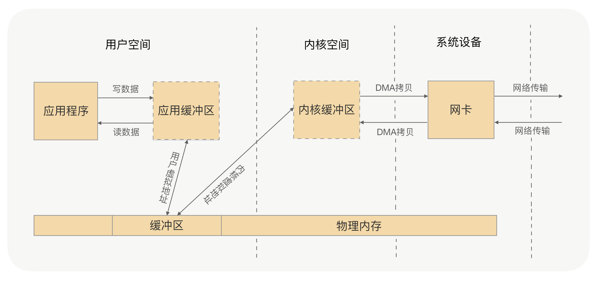
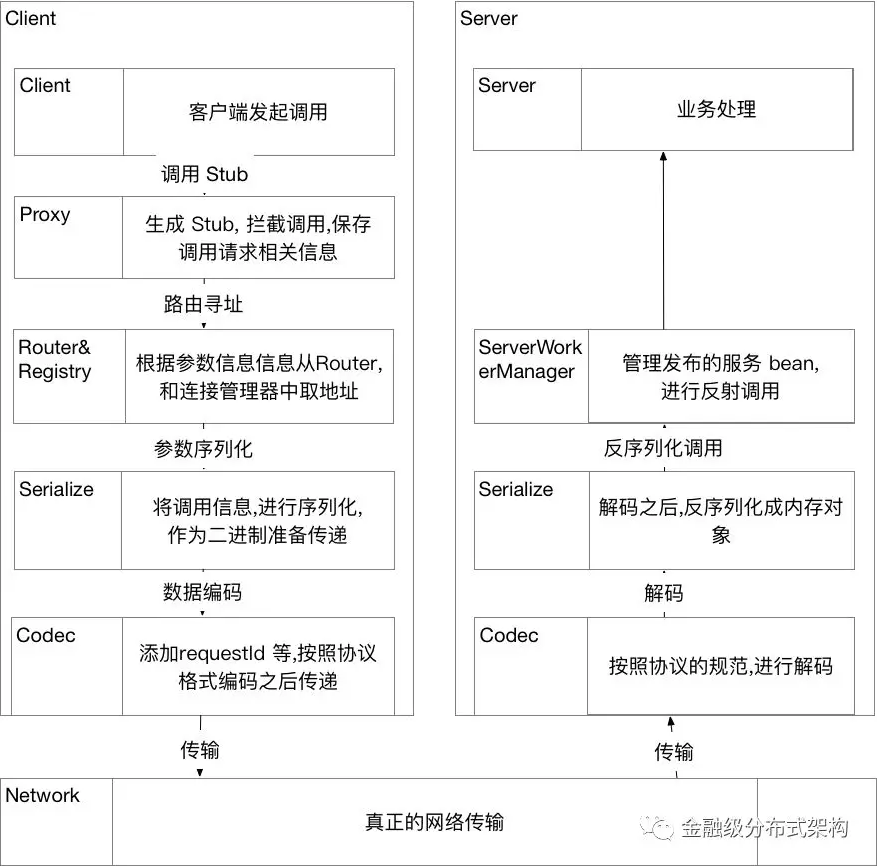

# 包含Netty和RPC的练习例子
## 1. 动态代理
### 1.1. dynamic-proxy-jdk
JDK自带的动态代理

[dynamic-proxy-jdk](./dynamic-proxy-jdk/README.md)

### 1.2. dynamic-proxy-javassist
javassist动态代理，`Javassist`的定位是能够操纵底层字节码，所以使用起来并不简单，要生成动态代理类恐怕是有点复杂了。
但好的方面是，通过`Javassist`生成字节码，不需要通过反射完成方法调用，所以性能肯定是更胜一筹的。在使用中，我们要注意一个问题，
通过`Javassist`生成一个代理类后，此`CtClass`对象会被冻结起来，不允许再修改；否则，再次生成时会报错。

[dynamic-proxy-javassist](./dynamic-proxy-javassist/README.md)

### 1.3. dynamic-proxy-byte-buddy
`byte buddy`实现的动态代理，`Byte Buddy`在动态代理工具类中属于后起之秀，在很多优秀的项目中，像 `Spring`、`Jackson`都用到了`Byte Buddy`来完成底层代理。
相比`Javassist`，`Byte Buddy`提供了更容易操作的`API`，编写的代码可读性更高。更重要的是，生成的代理类执行速度比`Javassist`更快。

[dynamic-proxy-byte-buddy](./dynamic-proxy-byte-buddy/README.md)

## 2. 序列化
### 2.1. serialize-hessian
hessian序列化
### 2.2. serialize-protobuf
protobuf序列化需要编写proto文件，使用protobuf带的编译工具生成不同语言的代码。

## 3. SPI(Service Provider Interface)
SPI 全称为 (Service Provider Interface) ，是JDK内置的一种服务提供发现机制。
SPI是一种动态替换发现的机制， 比如有个接口，想运行时动态的给它添加实现，你只需要添加一个实现。
当服务的提供者提供了一种接口的实现之后，需要在classpath下的META-INF/services/目录里创建一个以服务接口命名的文件，
这个文件里的内容就是这个接口的具体的实现类。当其他的程序需要这个服务的时候，就可以通过查找这个jar包（一般都是以jar包做依赖）
的META-INF/services/中的配置文件，配置文件中有接口的具体实现类名，可以根据这个类名进行加载实例化，就可以使用该服务了。
JDK中查找服务实现的工具类是：java.util.ServiceLoader。

[Java SPI机制详解](https://juejin.im/post/5af952fdf265da0b9e652de3)

## 4. Netty
### 4.1. 数据的两次拷贝

### 4.2. 零拷贝(Zero-copy)技术
所谓的零拷贝，就是取消用户空间与内核空间之间的数据拷贝操作，应用进程每一次的读写操作，
可以通过一种方式，直接将数据写入内核或从内核中读取数据，
再通过 DMA 将内核中的数据拷贝到网卡，或将网卡中的数据 copy 到内核。


零拷贝有两种解决方式，分别是  mmap+write  方式和  sendfile  方式，其核心原理都是通过虚拟内存来解决的
### 4.3. Netty的零拷贝
上面讲的零拷贝是操作系统层面上的零拷贝，主要目标是避免用户空间与内核空间之间的数据拷贝操作，可以提升 CPU 的利用率。

Netty 的零拷贝则不大一样，他完全站在了用户空间上，也就是 JVM 上，它的零拷贝主要是偏向于数据操作的优化上。

那么 Netty 是怎么对数据操作进行优化的呢？
* Netty 提供了 CompositeByteBuf 类，它可以将多个 ByteBuf 合并为一个逻辑上的  ByteBuf，避免了各个 ByteBuf 之间的拷贝。
* ByteBuf 支持 slice 操作，因此可以将 ByteBuf 分解为多个共享同一个存储区域的 ByteBuf，避免了内存的拷贝。
* 通过 wrap 操作，我们可以将 byte[] 数组、ByteBuf、ByteBuffer  等包装成一个 Netty ByteBuf 对象, 进而避免拷贝操作。

### 4.4 Netty的Reactor模型和最佳实践
1. Reactor模型
* 我们在初始化`ServerBootstrap`时需要传递两个`EventLoopGroup`，通常用于处理建连事件的线程，叫做`bossGroup`,对于`ServerBootstrap`的第一个参数`parentGroup`，我们也称之为`Acceptor`线程；
  处理已创建好的`channel`相关连IO事件的线程，叫做`workerGroup`,对应`ServerBootstrap`构造方法里的`childGroup`参数，即我们常说的`IO`线程。
  
* **最佳实践**：通常`bossGroup`只需要设置为`1`即可，因为 `ServerSocketChannel` 在初始化阶段，只会注册到某一个 `eventLoop` 上，
  而这个 `eventLoop` 只会有一个线程在运行，所以没有必要设置为多线程（什么时候需要多线程呢，可以参考 Norman Maurer 在 StackOverflow 上的这个回答）；
  而 IO 线程，为了充分利用 CPU，同时考虑减少线上下文切换的开销，通常设置为 CPU 核数的两倍，这也是 Netty 提供的默认值。
2. 串行化设计理念
* `Netty` 从 4.x 的版本之后，所推崇的设计理念是串行化处理一个 `Channel` 所对应的所有 IO 事件和异步任务，单线程处理来规避并发问题。
   `Netty` 里的 `Channel` 在创建后，会通过 `EventLoopGroup` 注册到某一个 `EventLoop` 上，之后该 `Channel` 所有读写事件，
   以及经由 `ChannelPipeline` 里各个 `Handler` 的处理，都是在这一个线程里。一个 `Channel` 只会注册到一个 `EventLoop` 上，
   而一个 `EventLoop` 可以注册多个 `Channel` 。所以我们在使用时，也需要尽可能避免使用带锁的实现，能无锁化就无锁。
* **最佳实践**：`Channel` 的实现是线程安全的，因此我们通常在运行时，会保存一个 `Channel` 的引用，同时为了保持 `Netty` 的无锁化理念，也应该尽可能避免使用带锁的实现，
  尤其是在 Handler 里的处理逻辑。举个例子：这里会有一个比较特殊的容易死锁的场景，比如在业务线程提交异步任务前需要先抢占某个锁，
  `Handler` 里某个异步任务的处理也需要获取同一把锁。如果某一个时刻业务线程先拿到锁 `lock1`，同时 `Handler` 里由于事件机制触发了一个异步任务 `A`，并在业务线程提交异步任务之前，
  提交到了 `EventLoop` 的队列里。之后，业务线程提交任务 `B`，等待 `B` 执行完成后才能释放锁 `lock1`；而任务 `A` 在队列里排在 `B` 之前，先被执行，执行过程需要获取锁 `lock1` 才能完成。
  这样死锁就发生了，与常见的资源竞争不同，而是任务执行权导致的死锁。要规避这类问题，最好的办法就是不要加锁；如果实在需要用锁，需要格外注意 `Netty` 的线程模型与任务处理机制。
3. 业务处理
* `IO` 密集型的轻计算业务：此时线程的上下文切换消耗，会比 `IO` 线程的占用消耗更为突出，所以我们通常会建议在 `IO` 线程来处理请求（和`Netty`的`Handler`在一个线程里）；
* `CPU` 密集型的计算业务：比如需要做远程调用，操作 `DB` 的业务，此时 `IO` 线程的占用远远超过线程上下文切换的消耗，所以我们就会建议在单独的业务线程池里来处理请求，
  以此来释放 `IO` 线程的占用。该模式，也是我们蚂蚁微服务，消息通信等最常使用的模型。该模式在后面的 `RPC` 协议实现举例部分会详细介绍。
* 如文章开头所描述的场景，我们需要合理设计，来将硬件的 IO 能力，CPU 计算能力与内存结合起来，发挥最佳的效果。针对不同的业务类型，我们会选择不同的处理方式。
* **最佳实践**：“Never block the event loop, reduce context-swtiching”，引自Netty committer Norman Maurer，另外阿里 HSF 的作者毕玄也有类似的总结。
4. 其他实践建议
* 最小化线程池，能复用 `EventLoopGroup` 的地方尽量复用。比如蚂蚁因为历史原因，有过两版 `RPC` 协议，在两个协议升级过渡期间，
  我们会复用 `Acceptor` 线程与 IO 线程在同一个端口处理不同协议的请求；除此，针对多应用合并部署的场景，我们也会复用 IO 线程防止一个进程开过多的 IO 线程。
* 对于无状态的 `ChannelHandler` ，设置成共享模式。比如我们的事件处理器，RPC 处理器都可以设置为共享，减少不同的 `Channel` 对应的 `ChannelPipeline` 里生成的对象个数。
* 正确使用 `ChannelHandlerContext` 的 `ctx.write()` 与 `ctx.channel().write()` 方法。前者是从当前 `Handler` 的下一个 `Handler` 开始处理，
  而后者会从 `tail` 开始处理。大多情况下使用 `ctx.write()` 即可。
* 在使用 `Channel` 写数据之前，建议使用 `isWritable()` 方法来判断一下当前 `ChannelOutboundBuffer` 里的写缓存水位，防止 `OOM` 发生。
  不过实践下来，正常的通信过程不太会 `OOM`，但当网络环境不好，同时传输报文很大时，确实会出现限流的情况。

## 5. RPC
### 5.1. 通用RPC流程


其中
1. 创建代理解决了 Stub 的问题。
2. 序列化和网络协议编码解决了打包的问题。
3. 服务发现与路由寻址解决了如何知道目标地址的问题。
4. 如何发布一个服务，Registry 来解决。
5. Bolt，Netty 等解决了网络传输的问题。

[SOFARPC 框架之总体设计与扩展机制](https://mp.weixin.qq.com/s/ZKUmmFT0NWEAvba2MJiJfA)

### 5.2. jdk-rpc
jdk-rpc是不使用任何第三方包的简单rpc，使用JDK动态代理隐藏client和server的交互细节，使用ServerSocke和Socket进行网络通信。
### 5.3. laoqian-rpc老钱博客RPC

博客地址：[老钱博客](https://juejin.im/post/5ad2a99ff265da238d51264d)

这个RPC是使用Netty和fastjson实现，这个例子是计算斐波那契数和指数。斐波那契数输入输出比较简单，一个Integer，一个Long。 
指数输入有两个值，输出除了计算结果外还包含计算耗时，以纳秒计算。之所以包含耗时，只是为了呈现一个完整的自定义的输入和输出类。

* 自定义协议类型
* 没有使用代理
* 通过type来确定使用那个处理器处理请求
* 包含消息唯一ID
* 使用JSON序列化

### 5.4. sofarpc-rpc
是`SOFARPC`蚂蚁金服`RPC`框架，`SOFARPC`是类似与`dubbo`的`RPC`框架，它有蚂蚁金服推出，底层通讯框架是`SOFABolt`，是蚂蚁金服基于`Netty`开发的。
#### 5.4.1 SOFARPC动态代理
1. SOFARPC默认的动态代理是使用javassist实现，通过生成接口的代理对象，在不提供接口实现类就可以创建接口的代理类。
并且代理对象继承了`java.lang.reflect.Proxy`类，可以查看JavassistProxy类的getProxy方法，代码如下：
```java
@Override
@SuppressWarnings("unchecked")
public <T> T getProxy(Class<T> interfaceClass, Invoker proxyInvoker) {
    StringBuilder debug = null;
    if (LOGGER.isDebugEnabled()) {
        debug = new StringBuilder();
    }
    try {
        Class clazz = PROXY_CLASS_MAP.get(interfaceClass);
        if (clazz == null) {
            //生成代理类
            String interfaceName = ClassTypeUtils.getTypeStr(interfaceClass);
            ClassPool mPool = ClassPool.getDefault();
            mPool.appendClassPath(new LoaderClassPath(ClassLoaderUtils.getClassLoader(JavassistProxy.class)));
            CtClass mCtc = mPool.makeClass(interfaceName + "_proxy_" + counter.getAndIncrement());
            if (interfaceClass.isInterface()) {
                mCtc.addInterface(mPool.get(interfaceName));
            } else {
                throw new IllegalArgumentException(interfaceClass.getName() + " is not an interface");
            }

            // 继承 java.lang.reflect.Proxy
            mCtc.setSuperclass(mPool.get(java.lang.reflect.Proxy.class.getName()));
            CtConstructor constructor = new CtConstructor(null, mCtc);
            constructor.setModifiers(Modifier.PUBLIC);
            constructor.setBody("{super(new " + UselessInvocationHandler.class.getName() + "());}");
            mCtc.addConstructor(constructor);

            List<String> fieldList = new ArrayList<String>();
            List<String> methodList = new ArrayList<String>();

            fieldList.add("public " + Invoker.class.getCanonicalName() + " proxyInvoker = null;");
            createMethod(interfaceClass, fieldList, methodList);

            for (String fieldStr : fieldList) {
                if (LOGGER.isDebugEnabled()) {
                    debug.append(fieldStr).append("\n");
                }
                mCtc.addField(CtField.make(fieldStr, mCtc));
            }
            for (String methodStr : methodList) {
                if (LOGGER.isDebugEnabled()) {
                    debug.append(methodStr).append("\n");
                }
                mCtc.addMethod(CtMethod.make(methodStr, mCtc));
            }
            if (LOGGER.isDebugEnabled()) {
                LOGGER.debug("javassist proxy of interface: {} \r\n{}", interfaceClass,
                    debug != null ? debug.toString() : "");
            }
            clazz = mCtc.toClass();
            PROXY_CLASS_MAP.put(interfaceClass, clazz);
        }
        Object instance = clazz.newInstance();
        clazz.getField("proxyInvoker").set(instance, proxyInvoker);
        return (T) instance;
    } catch (Exception e) {
        if (LOGGER.isDebugEnabled()) {
            LOGGER.debug("javassist proxy of interface: {} \r\n{}", interfaceClass,
                debug != null ? debug.toString() : "");
        }
        throw new SofaRpcRuntimeException("", e);
    }
}

private void createMethod(Class<?> interfaceClass, List<String> fieldList, List<String> resultList) {
    Method[] methodAry = interfaceClass.getMethods();
    StringBuilder sb = new StringBuilder(512);
    int mi = 0;
    for (Method m : methodAry) {
        mi++;
        if (Modifier.isNative(m.getModifiers()) || Modifier.isFinal(m.getModifiers())) {
            continue;
        }
        Class<?>[] mType = m.getParameterTypes();
        Class<?> returnType = m.getReturnType();

        sb.append(Modifier.toString(m.getModifiers()).replace("abstract", ""))
            .append(" ").append(ClassTypeUtils.getTypeStr(returnType)).append(" ").append(m.getName())
            .append("( ");
        int c = 0;

        for (Class<?> mp : mType) {
            sb.append(" ").append(mp.getCanonicalName()).append(" arg").append(c).append(" ,");
            c++;
        }
        sb.deleteCharAt(sb.length() - 1);
        sb.append(")");
        Class<?>[] exceptions = m.getExceptionTypes();
        if (exceptions.length > 0) {
            sb.append(" throws ");
            for (Class<?> exception : exceptions) {
                sb.append(exception.getCanonicalName()).append(" ,");
            }
            sb = sb.deleteCharAt(sb.length() - 1);
        }
        sb.append("{");

        sb.append(" Class clazz = ").append(interfaceClass.getCanonicalName()).append(".class;");
        sb.append(" ").append(Method.class.getCanonicalName()).append(" method =  method_").append(mi).append(";");
        sb.append(" Class[] paramTypes = new Class[").append(c).append("];");
        sb.append(" Object[] paramValues = new Object[").append(c).append("];");
        StringBuilder methodSig = new StringBuilder();
        for (int i = 0; i < c; i++) {
            sb.append("paramValues[").append(i).append("] = ($w)$").append(i + 1).append(";");
            sb.append("paramTypes[").append(i).append("] = ").append(mType[i].getCanonicalName()).append(".class;");
            methodSig.append("," + mType[i].getCanonicalName() + ".class");
        }

        fieldList.add("private " + Method.class.getCanonicalName() + " method_" + mi + " = "
            + ReflectUtils.class.getCanonicalName() + ".getMethod("
            + interfaceClass.getCanonicalName() + ".class, \"" + m.getName() + "\", "
            + (c > 0 ? "new Class[]{" + methodSig.toString().substring(1) + "}" : "new Class[0]") + ");"
            );

        sb.append(SofaRequest.class.getCanonicalName()).append(" request = ")
            .append(MessageBuilder.class.getCanonicalName())
            .append(".buildSofaRequest(clazz, method, paramTypes, paramValues);");
        sb.append(SofaResponse.class.getCanonicalName()).append(" response = ")
            .append("proxyInvoker.invoke(request);");
        sb.append("if(response.isError()){");
        sb.append("  throw new ").append(SofaRpcException.class.getName()).append("(")
            .append(RpcErrorType.class.getName())
            .append(".SERVER_UNDECLARED_ERROR,").append(" response.getErrorMsg());");
        sb.append("}");

        sb.append("Object ret = response.getAppResponse();");
        sb.append("if (ret instanceof Throwable) {");
        sb.append("    throw (Throwable) ret;");
        sb.append("} else {");
        if (returnType.equals(void.class)) {
            sb.append(" return;");
        } else {
            sb.append(" return ").append(asArgument(returnType, "ret")).append(";");
        }
        sb.append("}");

        sb.append("}");

        resultList.add(sb.toString());
        sb.delete(0, sb.length());
    }

    // toString()
    sb.append("public String toString() {");
    sb.append("  return proxyInvoker.toString();");
    sb.append("}");
    resultList.add(sb.toString());
    // hashCode()
    sb.delete(0, sb.length());
    sb.append("public int hashCode() {");
    sb.append("  return proxyInvoker.hashCode();");
    sb.append("}");
    resultList.add(sb.toString());
    // equals()
    sb.delete(0, sb.length());
    sb.append("public boolean equals(Object obj) {");
    sb.append("  return this == obj || (getClass().isInstance($1) && proxyInvoker.equals(")
        .append(JavassistProxy.class.getName()).append(".parseInvoker($1)));");
    sb.append("}");
    resultList.add(sb.toString());
}
```
其中上面的createMethod方法最后生成的代码是：
```java
public  java.lang.String sayHello(  java.lang.String arg0 ){ 
    Class clazz = cn.v5cn.sofarpc.rpc.HelloService.class; 
    java.lang.reflect.Method method =  method_1; 
    Class[] paramTypes = new Class[1]; 
    Object[] paramValues = new Object[1];
    paramValues[0] = ($w)$1;
    paramTypes[0] = java.lang.String.class;
    com.alipay.sofa.rpc.core.request.SofaRequest request = com.alipay.sofa.rpc.message.MessageBuilder.buildSofaRequest(clazz, method, paramTypes, paramValues);
    com.alipay.sofa.rpc.core.response.SofaResponse response = proxyInvoker.invoke(request);
    if(response.isError()){  
        throw new com.alipay.sofa.rpc.core.exception.SofaRpcException(com.alipay.sofa.rpc.core.exception.RpcErrorType.SERVER_UNDECLARED_ERROR, response.getErrorMsg());
    }
    Object ret = response.getAppResponse();
    if (ret instanceof Throwable) {    
        throw (Throwable) ret;
    } else { 
        return (java.lang.String)ret;
    }
}
```

2. SOFARPC还提供了JDK的动态代理实现(JDKProxy)，一直困扰动态代理需要提供被代理类的示例，也就是服务接口的实现这，那么在RPC场景中，
客户端是不知道服务接口实现类的实例的，那JDK动态代理（或者说大部分动态代理）如何在不提供服务接口实现类时，创建动态代理的，
今天看了`SOFARPC`的`JDK`动态代理，在恍然大悟。原来JDK动态代理的`InvocationHandler`实现的`invoke`方法中，如果不调用`method.invoke`方法
，是不需要提供服务接口实现类的。`jdk-rpc`模块就是不使用接口实现类的JDK动态代理，在服务端提供接口和实现类的映射关系，代码如下：
```java
private static final ConcurrentHashMap<String,Class<?>> INTERFACE_IMPLS = new ConcurrentHashMap<>();

//注册接口到服务
static {
    INTERFACE_IMPLS.put(SayHello.class.getName(),SayHelloImpl.class);
}
```

3. SOFARPC也提供了`byte buddy`动态代理，从代码量上看，`byte buddy`的实现要比javassist简单许多。代码如下：
```java
@Override
public <T> T getProxy(Class<T> interfaceClass, Invoker proxyInvoker) {

    Class<? extends T> cls = PROXY_CLASS_MAP.get(interfaceClass);
    if (cls == null) {
        cls = new ByteBuddy()
            .subclass(interfaceClass)
            .method(
                ElementMatchers.isDeclaredBy(interfaceClass).or(ElementMatchers.isEquals())
                    .or(ElementMatchers.isToString().or(ElementMatchers.isHashCode())))
            .intercept(MethodDelegation.to(new BytebuddyInvocationHandler(proxyInvoker), "handler"))
            .make()
            .load(interfaceClass.getClassLoader(), ClassLoadingStrategy.Default.INJECTION)
            .getLoaded();

        PROXY_CLASS_MAP.put(interfaceClass, cls);
    }
    try {
        return cls.newInstance();
    } catch (Throwable t) {
        throw new SofaRpcRuntimeException("construct proxy with bytebuddy occurs error", t);
    }

}
```

## 6. RPC博客
[剖析 | SOFARPC 框架之总体设计与扩展机制](https://mp.weixin.qq.com/s/ZKUmmFT0NWEAvba2MJiJfA)
[蚂蚁通信框架实践](https://mp.weixin.qq.com/s/JRsbK1Un2av9GKmJ8DK7IQ)

## 7. queue-disruptor
[`queue-disruptor`](./queue-disruptor/README.md)是队列`Disruptor`的例子。

