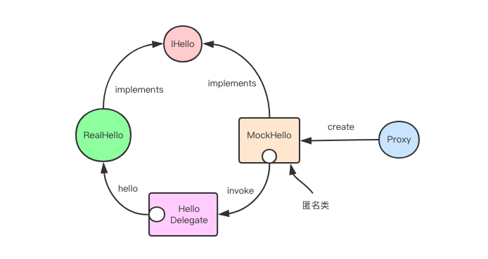

## JDK动态代理

> 为了便于理解，我们用图来表示上面的对象的关系。我们调用`Proxy.newProxyInstance`产生了一个匿名类实例，
> 该实例同样实现了`IHello`接口(`System.out.println(iHello.getClass().getInterfaces()[0].getName());`可以查看其实现的接口)，
> 它的作用就是用来替代原生的`RealHello`实例。
> 这个匿名实例持有`HelloDelegate`实例的引用，当你对这个匿名实例进行方法调用时，它会将调用逻辑委托给`HelloDelegate`实例的`invoke`方法。
> `HelloDelegate`实例内部又持有原生`RealHello`对象的引用，所以用户就可以在`invoke`方法里实现任意附加逻辑，以及对原生`RealHello`对象的调用。
>
> 上面是`jdk`自带的动态代理技术，它的缺点是必须定义接口才能实现目标对象的方法增强，甚至想使用`abstract class`来替代也不行。
> 所以开源市场上冒出了好几个动态代理的库，
> 用于替代原生的`jdk`动态代理技术，它们不仅仅功能更强大，而且内部使用了字节码增强实现，在性能上还也要比原生`jdk`高出很多。

> 作者：老錢
链接：https://juejin.im/post/5b0fa21a6fb9a00a21796846
来源：掘金
著作权归作者所有。商业转载请联系作者获得授权，非商业转载请注明出处。