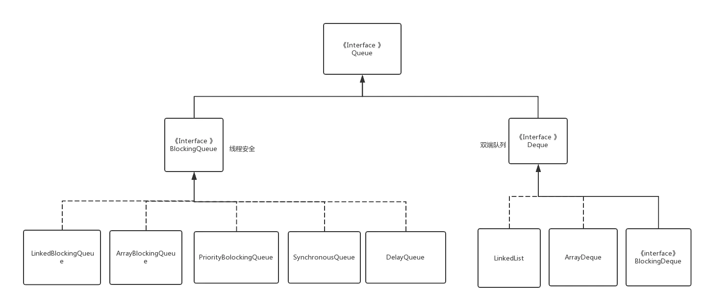

# 使用Disruptor步骤
## 1. 定义事件
事件(Event)就是通过 Disruptor 进行交换的数据类型。
## 2. 定义事件工厂
事件工厂(`Event Factory`)定义了如何实例化前面第1步中定义的事件(`Event`)，需要实现接口`com.lmax.disruptor.EventFactory<T>`。
`Disruptor`通过`EventFactory`在`RingBuffer`中预创建`Event`的实例。

一个`Event`实例实际上被用作一个“数据槽”，发布者发布前，先从`RingBuffer`获得一个`Event`的实例，然后往`Event`实例中填充数据，之后再发布到`RingBuffer`中，
之后由`Consumer`获得该`Event`实例并从中读取数据。
## 3. 定义事件处理的具体实现
通过实现接口`com.lmax.disruptor.EventHandler<T>`定义事件处理的具体实现。
## 4. 定义用于事件处理的线程池
`Disruptor`通过`java.util.concurrent.ExecutorService`提供的线程来触发`Consumer`的事件处理。如：
```java
    private final static ThreadPoolExecutor EXECUTOR = new ThreadPoolExecutor(5,
            200,
            0L,
            TimeUnit.MILLISECONDS,
            new LinkedBlockingQueue<Runnable>(1024),
            Executors.defaultThreadFactory(),new ThreadPoolExecutor.AbortPolicy());
```
> **新版本只需要指定一个ThreadFactory就可以。**
## 5. 指定等待策略
`Disruptor`定义了`com.lmax.disruptor.WaitStrategy`接口用于抽象`Consumer`如何等待新事件，这是策略模式的应用。

`Disruptor`提供了多个`WaitStrategy`的实现，每种策略都具有不同性能和优缺点，根据实际运行环境的`CPU`的硬件特点选择恰当的策略，并配合特定的`JVM`的配置参数，
能够实现不同的性能提升。

例如:`BlockingWaitStrategy`、`SleepingWaitStrategy`、`YieldingWaitStrategy`等，其中，

* `BlockingWaitStrategy`是最低效的策略，但其对`CPU`的消耗最小并且在各种不同部署环境中能提供更加一致的性能表现；
* `SleepingWaitStrategy`的性能表现跟`BlockingWaitStrategy`差不多，对`CPU`的消耗也类似，但其对生产者线程的影响最小，适合用于异步日志类似的场景；
* `YieldingWaitStrategy`的性能是最好的，适合用于低延迟的系统。在要求极高性能且事件处理线数小于`CPU`逻辑核心数的场景中，推荐使用此策略；例如，`CPU`开启超线程的特性。

```java
WaitStrategy BLOCKING_WAIT = new BlockingWaitStrategy();
WaitStrategy SLEEPING_WAIT = new SleepingWaitStrategy();
WaitStrategy YIELDING_WAIT = new YieldingWaitStrategy();
```
## 6. 启动Disruptor
组装各个组件，并启动`Disruptor`，查看`DisruptorMain`类。

## 7. 发布事件
Disruptor 的事件发布过程是一个两阶段提交的过程：

* 第一步：先从 RingBuffer 获取下一个可以写入的事件的序号；
* 第二步：获取对应的事件对象，将数据写入事件对象；
* 第三步：将事件提交到 RingBuffer;
事件只有在提交之后才会通知 EventProcessor 进行处理；

`LongEventProducer`这个类。

注意，最后的`ringBuffer.publish`方法必须包含在`finally`中以确保必须得到调用；如果某个请求的`sequence`未被提交，将会堵塞后续的发布操作或者其它的`producer`。

`Disruptor`还提供另外一种形式的调用来简化以上操作，并确保`publish`总是得到调用。（`LongEventProducerWithTranslator`类）
## 关闭 Disruptor
```java
disruptor.shutdown();//关闭 disruptor，方法会堵塞，直至所有的事件都得到处理；
```

[原作者](https://www.jianshu.com/p/8473bbb556af)

# 参考文章


* [Java中的队列](https://www.jianshu.com/p/cdeab52c0a07)

* [你应该知道的高性能无锁队列Disruptor](https://juejin.im/post/5b5f10d65188251ad06b78e3)