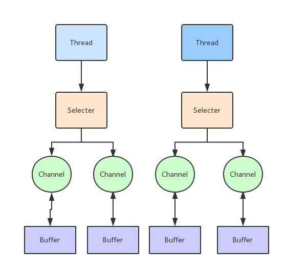

## other
other工程是记录一些平时练习的小例子，例如：算法，并发，异步之类的。
### `futures`包
该包是练习一下，`CompletableFuture`

Future是Java 5添加的类，`future`在执行的时候支持异步处理，但是在回调的过程中依旧是难免会遇到需要等待的情况。
用来描述一个异步计算的结果。你可以使用isDone方法检查计算是否完成，或者使用get阻塞住调用线程，直到计算完成返回结果，你也可以使用cancel方法停止任务的执行。

在`jdk8`里面，出现了`CompletableFuture`的新概念，支持对于异步处理完成任务之后自行处理数据。当发生异常的时候也能按照自定义的逻辑来处理。

* `CompletableFuture`是java8引入的新类，该类实现了 `Future` 接口和 `CompletionStage` 接口，封装了`future`、`forkjoin`相关类来执行异步，所以你还是可以像以前一样通过阻塞(get)或者轮询的方式获得结果，尽管这种方式不推荐使用。
* `CompletionStage` 接口代表异步计算中的 不同阶段，以及如何 组合 这些计算阶段。
* `CompletableFuture` 接口中有 50 多个方法，可以对 `CompletableFuture` 进行组合、计算，方法看似很多，但可以按功能对其分类，大多数方法都有 3 种变体：

* 不带 `Async` 方法：同步方法
* 带 `Async`，只有一个参数：异步方法，使用默认的 `ForkJoinPool.commonPool()` 获取线程池
* 带 `Async`，有两个参数：异步方法，且使用第二个参数指定的 `ExecutorService` 线程池

[Java CompletableFuture 详解](https://colobu.com/2016/02/29/Java-CompletableFuture/)

[CompletableFuture 详解](https://www.jianshu.com/p/6f3ee90ab7d3)

[java8 CompletableFuture入门](https://juejin.im/post/5c77b3ade51d456a045898c8)

### `lru`包
是练习写一个简单的LRU（最近最少使用）的缓存淘汰策略

1、`linked`子包是使用`LinkedHashMap`实现的，`LinkedHashMap`默认自带两个特性可以支持LRU策略
* `accessOrder=true`表示按照最近使用的排序策略把最近使用的排在前面，默认是`false`是按照插入顺序
* 重写`LinkedHashMap`的下面方法，根据条件淘汰最近最少使用的
```java
@Override
protected boolean removeEldestEntry(Map.Entry<K, V> eldest) {
    //当大小查过传入的乏值时，将按照最近最少使用淘汰数据（LRU）
    return size() > capacity;
}
```
2、`lhm`子包是自定义的`HashMap`+链表的实现方式。
3、`casfaa`子包是使用锁、CAS和FAA原语来并发操作同一个资源。

### Java nio
`java.io`中最为核心的一个概念是流(`Stream`),面向流的编程。`Java`中,一个流要么是输入流,要么是输出流,不可能同时既是输入流又是输出流。
`java.nio`中拥有3个核心概念: `Selector`, `Channel`与 `Buffer`。在`java.nio`中,我们是面向块(`block`)或是缓冲区(`buffer`)编程的。
`Buffer`本身就是一块内存,底层实现上,它实际上是个数组。数据的读、写都是通过 `Buffer`来实现的。
#### Selector、Channel和Buffer关系图


[Java NIO](https://scala.cool/2017/11/java-nio/)

[Java NIO编程实例之三Selector](https://zhuanlan.zhihu.com/p/26243285)

### ppt_to_image
改包是使用Apache POI对ppt转换成图片。
代码来自https://github.com/Hansanshi/pptutil

### command包
command包是java执行shell脚本测试超时时间。