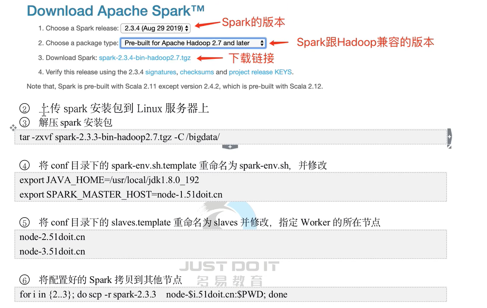
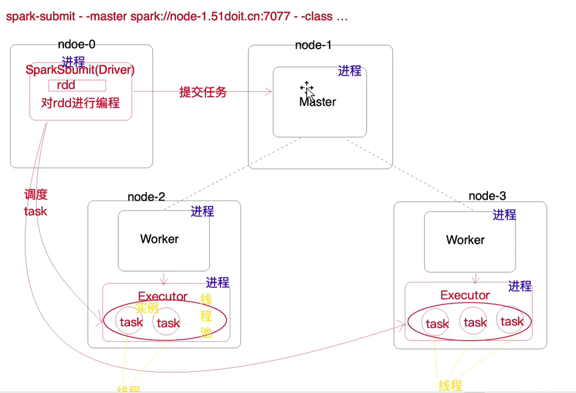

# Spark2.4.5版本

## 1. Spark安装


## 2. 安装问题
### 2.1 如果是旧的Spark环境。
问题描述：Spark环境启动没有问题，执行任务一直无限循环。

解决办法：Spark默认的临时文件在/tmp目录下。停止集群，把它删除掉启动就好了。
### 2.2 无法连接HDFS
日志如下：
```text
20/04/23 22:26:53 WARN TaskSetManager: Lost task 0.0 in stage 0.0 (TID 0, 192.168.1.183, executor 0): org.apache.hadoop.hdfs.BlockMissingException: Could not obtain block: BP-896938306-192.168.1.181-1578294949829:blk_1073741869_1045 file=/wc/wordcount.txt
	at org.apache.hadoop.hdfs.DFSInputStream.chooseDataNode(DFSInputStream.java:984)
	at org.apache.hadoop.hdfs.DFSInputStream.blockSeekTo(DFSInputStream.java:642)
	at org.apache.hadoop.hdfs.DFSInputStream.readWithStrategy(DFSInputStream.java:882)
	at org.apache.hadoop.hdfs.DFSInputStream.read(DFSInputStream.java:934)
	at java.io.DataInputStream.read(DataInputStream.java:149)
	at org.apache.hadoop.mapreduce.lib.input.UncompressedSplitLineReader.fillBuffer(UncompressedSplitLineReader.java:62)
	at org.apache.hadoop.util.LineReader.readDefaultLine(LineReader.java:216)
	at org.apache.hadoop.util.LineReader.readLine(LineReader.java:174)
	at org.apache.hadoop.mapreduce.lib.input.UncompressedSplitLineReader.readLine(UncompressedSplitLineReader.java:94)
	at org.apache.hadoop.mapred.LineRecordReader.skipUtfByteOrderMark(LineRecordReader.java:208)
	at org.apache.hadoop.mapred.LineRecordReader.next(LineRecordReader.java:246)
	at org.apache.hadoop.mapred.LineRecordReader.next(LineRecordReader.java:48)
	at org.apache.spark.rdd.HadoopRDD$$anon$1.getNext(HadoopRDD.scala:293)
	at org.apache.spark.rdd.HadoopRDD$$anon$1.getNext(HadoopRDD.scala:224)
	at org.apache.spark.util.NextIterator.hasNext(NextIterator.scala:73)
	at org.apache.spark.InterruptibleIterator.hasNext(InterruptibleIterator.scala:37)
	at scala.collection.Iterator$$anon$11.hasNext(Iterator.scala:409)
	at scala.collection.Iterator$$anon$12.hasNext(Iterator.scala:440)
	at scala.collection.Iterator$$anon$11.hasNext(Iterator.scala:409)
	at org.apache.spark.util.collection.ExternalSorter.insertAll(ExternalSorter.scala:191)
	at org.apache.spark.shuffle.sort.SortShuffleWriter.write(SortShuffleWriter.scala:62)
	at org.apache.spark.scheduler.ShuffleMapTask.runTask(ShuffleMapTask.scala:99)
	at org.apache.spark.scheduler.ShuffleMapTask.runTask(ShuffleMapTask.scala:55)
	at org.apache.spark.scheduler.Task.run(Task.scala:123)
	at org.apache.spark.executor.Executor$TaskRunner$$anonfun$10.apply(Executor.scala:408)
	at org.apache.spark.util.Utils$.tryWithSafeFinally(Utils.scala:1360)
	at org.apache.spark.executor.Executor$TaskRunner.run(Executor.scala:414)
	at java.util.concurrent.ThreadPoolExecutor.runWorker(ThreadPoolExecutor.java:1149)
	at java.util.concurrent.ThreadPoolExecutor$Worker.run(ThreadPoolExecutor.java:624)
	at java.lang.Thread.run(Thread.java:748)
```
解决办法：
首先保证`HDFS`集群本身没有问题，在管理界面可以正常下载文件。关闭`HDFS`所在机器的防火墙。

## 3. 提交任务

```shell script
./spark-submit 
# 指定master节点
--master spark://127.0.0.1:7077 \
# 指定计算内存
--executor-memory 512m \
# 指定计算核数
--total-executor-cores 4 \
# 指定程序的Main方法类和需要提供的参数
--class cn.v5cn.spark.demo.Main /root/WordCount.jar hdfs://127.0.0.1:9000/wc hdfs://127.0.0.1:9000/out2
```
## 4. Spark架构体系


## 5. Spark和Yarn中角色对比
