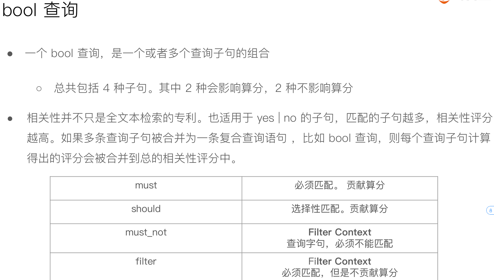
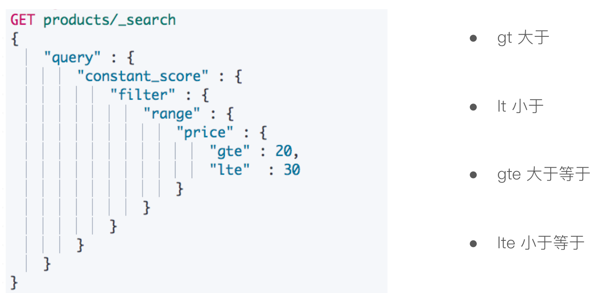
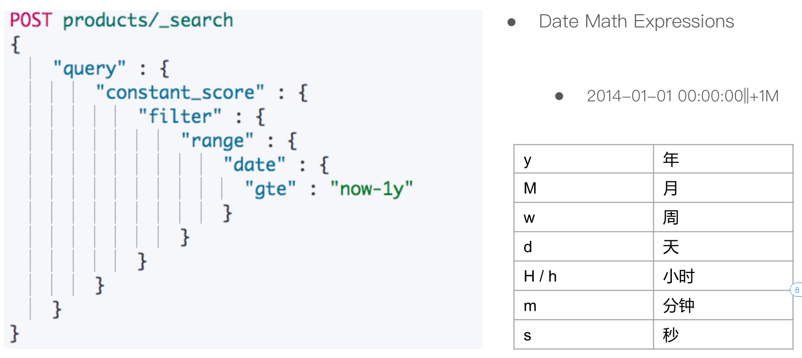
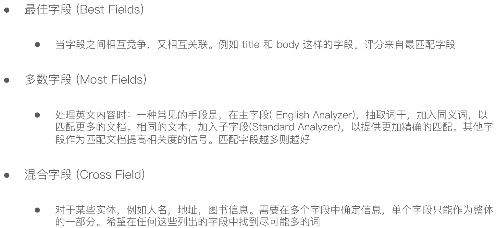
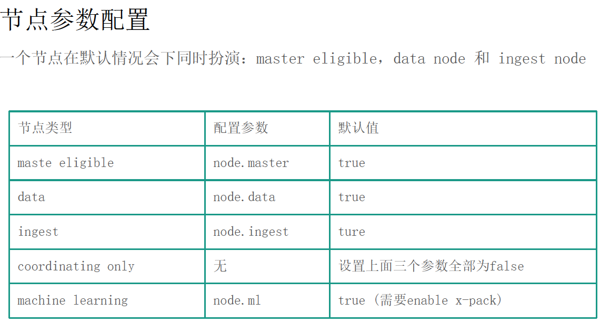
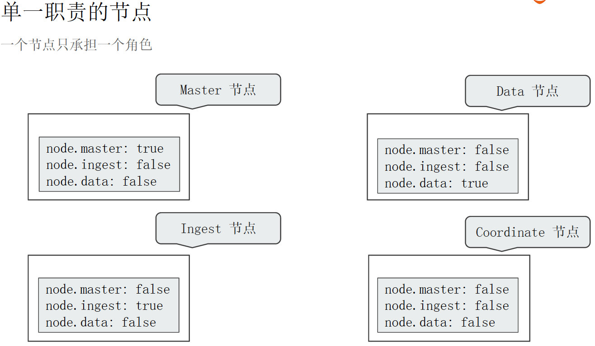

## docker-compose安装
```shell script
curl -L https://get.daocloud.io/docker/compose/releases/download/1.25.0/docker-compose-`uname -s`-`uname -m` > /usr/local/bin/docker-compose;
```

## Elasticsearch7.5.1 docker-compose安装ES
```yaml
version: '2.2'
services:
  cerebro:
    image: lmenezes/cerebro:0.8.5
    container_name: cerebro
    ports:
      - "9000:9000"
    command:
      - -Dhosts.0.host=http://elasticsearch:9200
    networks:
      - es7net
  kibana:
    image: docker.elastic.co/kibana/kibana:7.5.1
    container_name: kibana7
    environment:
      - I18N_LOCALE=zh-CN
      - XPACK_GRAPH_ENABLED=true
      - TIMELION_ENABLED=true
      - XPACK_MONITORING_COLLECTION_ENABLED="true"
    ports:
      - "5601:5601"
    networks:
      - es7net
  elasticsearch:
    image: docker.elastic.co/elasticsearch/elasticsearch:7.5.1
    container_name: es7_01
    environment:
      - cluster.name=geektime
      - node.name=es7_01
      - bootstrap.memory_lock=true
      - "ES_JAVA_OPTS=-Xms512m -Xmx512m"
      - discovery.seed_hosts=es7_01,es7_02
      - cluster.initial_master_nodes=es7_01,es7_02
    ulimits:
      memlock:
        soft: -1
        hard: -1
    volumes:
      - es7data1:/usr/share/elasticsearch/data
    ports:
      - 9200:9200
    networks:
      - es7net
  elasticsearch2:
    image: docker.elastic.co/elasticsearch/elasticsearch:7.5.1
    container_name: es7_02
    environment:
      - cluster.name=geektime
      - node.name=es7_02
      - bootstrap.memory_lock=true
      - "ES_JAVA_OPTS=-Xms512m -Xmx512m"
      - discovery.seed_hosts=es7_01,es7_02
      - cluster.initial_master_nodes=es7_01,es7_02
    ulimits:
      memlock:
        soft: -1
        hard: -1
    volumes:
      - es7data2:/usr/share/elasticsearch/data
    networks:
      - es7net


volumes:
  es7data1:
    driver: local
  es7data2:
    driver: local

networks:
  es7net:
    driver: bridge
```
### 安装ES异常
1. vm.max_map_count
```text
[1]: max virtual memory areas vm.max_map_count [65530] is too low, increase to at least [262144]
```
解决：
先要切换到root用户；
然后可以执行以下命令，设置 vm.max_map_count ，但是重启后又会恢复为原值。
```shell script
sysctl -w vm.max_map_count=262144
```
持久性的做法是在 /etc/sysctl.conf 文件中修改 vm.max_map_count 参数：
```shell script
echo "vm.max_map_count=262144" > /etc/sysctl.conf
sysctl -p
```

## 索引创建和查询
```json
# 查看插件列表
GET /_cat/plugins

#ik_max_word
#ik_smart
#hanlp: hanlp默认分词
#hanlp_standard: 标准分词
#hanlp_index: 索引分词
#hanlp_nlp: NLP分词
#hanlp_n_short: N-最短路分词
#hanlp_dijkstra: 最短路分词
#hanlp_crf: CRF分词（在hanlp 1.6.6已开始废弃）
#hanlp_speed: 极速词典分词

POST _analyze
{
  "analyzer": "hanlp_standard",
  "text": ["剑桥分析公司多位高管对卧底记者说，他们确保了唐纳德·特朗普在总统大选中获胜"]

}

# 查看索引模板
GET /_cat/templates

# 创建索引
PUT /security-evaluation-v35
{
    "settings" : {
      "analysis": {
        "analyzer": {
          
          "hanlp": {
            "tokenizer": "hanlp_standard"
          },
          "pinyin": {
            "tokenizer": "pinyin"
          }
        }
      }
    }
}
# 查看索引
GET /security-evaluation-v2/_search
{
  "query": {
    "match": {
      "title.pinyin": "biaoti"
    }
  }
}

# 多条件查询
GET /security-evaluation-v2/_search
{
  "query": {
    "bool": {
      "must": [
        {"match": {
          "type": "3"
        }}
      ], 
      "should": [
        {
          "match": { 
            "title": "zhangsan"
          }
        },
        {
          "match": {
            "name": "zhangsan"
          }
        },
        {
          "match": {
            "content": "zhangsan"
          }
        },
        {
          "match": {
            "title.pinyin": "zhangsan"
          }
        },
        {
          "match": {
            "name.pinyin": "zhangsan"
          }
        }
      ]
    }
  }, 
  "from": 0,
  "size": 20
}

# 删除索引
DELETE /security-evaluation-v1

# 查询索引信息
GET /security-evaluation-v2

# 查看该索引下字段是如何分词的
GET /security-evaluation-v35/_analyze
{
  "field": "name", 
  "text":"张三2"
}

#插入数据 PUT 插入必须指定id,POST可以自动生成id
PUT /security-evaluation-v2/_doc/3
{
  "content" : "在古老的 Hadoop1.0 中，MapReduce 的 JobTracker 负责了太多的工作，包括资源调度，管理众多的 TaskTracker 等工作。这自然是不合理的，于是 Hadoop 在 1.0 到 2.0 的升级过程中，便将 JobTracker 的资源调度工作独立了出来，而这一改动，直接让 Hadoop 成为大数据中最稳固的那一块基石。，而这个独立出来的资源管理框架，就是 Yarn",
    "createTime" : "2020-01-18 14:04:34",
    "fileId" : "1123455_13",
    "id" : 15795070137913,
    "name" : "赵六",
    "status" : "完成30%",
    "title" : "深入浅出 Hadoop YARN",
    "type" : 2
}

#创建mapping
PUT /security-evaluation-v2/_mapping
{
  "properties" : {
    "createTime" : {
      "type" : "text",
      "fields" : {
        "keyword" : {
          "type" : "keyword",
          "ignore_above" : 256
        }
      }
    },
    "fileId" : {
      "type" : "keyword",
      "index" : false
    },
    "id" : {
      "type" : "long"
    },
    "name" : {
      "type" : "text",
      "analyzer": "hanlp",
      "fields" : {
        "keyword" : {
          "type" : "keyword",
          "ignore_above" : 256
        },
        "pinyin" : {
          "type" : "text",
          "analyzer" : "pinyin"
        }
      }
    },
    "content" : {
      "type" : "text",
      "analyzer": "hanlp",
      "fields" : {
        "keyword" : {
          "type" : "keyword",
          "ignore_above" : 256
        }
      }
    },
    "status" : {
      "type" : "text",
      "fields" : {
        "keyword" : {
          "type" : "keyword",
          "ignore_above" : 256
        }
      }
    },
    "title" : {
      "type" : "text",
      "analyzer": "hanlp",
      "fields" : {
        "keyword" : {
          "type" : "keyword",
          "ignore_above" : 256
        },
        "pinyin" : {
          "type" : "text",
          "analyzer" : "pinyin"
        }
      }
    },
    "type" : {
      "type" : "long"
    }
  }
}
  
#URI查询
GET /security-evaluation-v2/_search?q=title:标题

#带profile的查询
GET /security-evaluation-v2/_search?q=标题5&df=title
{
  "profile": "true"
}

#泛查询，正对_all,所有字段，性能不佳
GET /security-evaluation-v2/_search?q=标题
{
  "profile": "true"
}

#使用双引号，Phrase查询，双引号包含的内容出现的顺序必须一致和必须同时出现
#"标题 2"，等效于 标题 AND 2 。Phrase查询，还要求前后顺序保持一致
GET /security-evaluation-v2/_search?q=title:"标题 2"
{
  "profile": "true"
}

#不加双引号的 标题 2 相当于 标题 OR 2
GET /security-evaluation-v2/_search?q=title:标题 2
{
  "profile": "true"
}

# 分组，Bool查询 (标题 AND 2) (标题 2)=(标题 OR 2) (标题 NOT 2)表示必须包括标题但不包括2
GET /security-evaluation-v2/_search?q=title:(标题 2)
{
  "profile": "true"
}
#URI还可以使用通配符*，?和正则表达式的查询语法

#-------------------------------------------------------------------------------------#

#Request Body查询 分页 排序
GET /security-evaluation-v2/_search
{
  "from": 0,
  "size": 20,
  "sort": [
    {
      "id": {
        "order": "desc"
      }
    }
  ], 
  "query": {
    "match_all": {}
  }
}

#指定_source返回需要的字段,_source支持通配符
POST /security-evaluation-v2/_search
{
  "query": {
    "match_all": {}
  }, 
  "_source": ["id","title"]
}

# 脚本字段
GET /security-evaluation-v2/_search
{
  "script_fields": {
    "new_name": {
      "script": {
        "lang": "painless",
        "source": "doc['type']"
      }
    }
  }, 
  "query": {
    "match_all": {}
  }
}

# Request Body中的match，如果是使用 "title":"标签2" 默认是标题和2的OR的关系，如果想使用AND的关系，需要添加operator操作符
GET /security-evaluation-v2/_search
{
  "query": {
    "match": {
      "title": {
        "query": "标题2",
        "operator": "or"
      },
      "name": {
        "query": "刘八"
      }
    }
  }
}

# 对字段查询
GET /security-evaluation-v2/_search
{
  "query": {
    "multi_match": {
      "query": "标题2",
      "fields": ["title","name","content","title.pinyin","name.pinyin"]
    }
  },
  "profile": "true"
}

# 多字段查询
# type是固定字段，查询type=1的(使用filter)，多字段查询，查询需要查询的字段
GET /security-evaluation-v2/_search
{
  "query": {
    "bool": {
      "filter": {
        "term": {
          "type": "1"
        }
      }, 
      "must": [
        {
          "multi_match": {
            "query": "标题2",
            "fields": ["title","name","content","title.pinyin","name.pinyin"]
          }
        }
      ]
    }
  },
  "profile": "true"
}


# 多字段查询
# type是固定字段，查询type=1的(使用match)和filter区别在于filter不参与算分性能更好，多字段查询，查询需要查询的字段
GET /security-evaluation-v2/_search
{
  "query": {
    "bool": {
      "must": [
        {
          "match": {
            "type": "1"
          }
        },
        {
          "multi_match": {
            "query": "标题2",
            "fields": ["title","name","content","title.pinyin","name.pinyin"]
          }
        }
      ]
    }
  },
  "profile": "true"
}

# 使用match phrase 默认情况跟上面使用了operator+and效果相同
GET /security-evaluation-v2/_search
{
  "query": {
    "match_phrase": {
      "title": {
        "query": "标题2"
      }
    }
  }
}

#------DisjunctionMaxQuery 查询-------
GET /security-evaluation-v2/_search
{
  "profile": "true", 
  "query": {
    "dis_max": {
      //1.获得最佳匹配语句的评分_score。
      //2.将其他匹配语句的评分与tie_breaker相乘。
      //3.对以上评分求和并规范化
      "tie_breaker": 0.7,
      "boost": 1.2,
      "queries": [
        {
          "match": {
            "title": "标题2"
          }
        },
        {
          "match": {
            "name": "张三2"
          }
        }
      ]
    }
  }
}

#-----------------------------------Query String和Simple Query String-----------------------------------

# "query":"标题 AND 2"、"query":"标题 NOT 2"或者"query":"标题 OR 2"，也可以使用()进行分组
GET /security-evaluation-v2/_search
{
  "query": {
    "query_string": {
      "default_field": "title",
      "query": "标题 OR 2"
    }
  }
}
GET /security-evaluation-v2/_search
{
  "query": {
    "query_string": {
      "fields": ["name","title"],
      "query": "(标题 OR 2) AND (张三 AND 2)"
    }
  }
}

#-----------------------------------index template和Dynamic Tempate-----------------------------------

# 查看index template
GET _template

GET _template/security-evaluation-template-v1

# 创建index 模板 index_patterns:security-evaluation-*表示所有使用security-evaluation-开头的都会应用该模板
PUT _template/security-evaluation-template-v1
{
  "index_patterns": "security-evaluation-*",
  "settings" : {
    "analysis": {
      "analyzer": {
        
        "hanlp": {
          "tokenizer": "hanlp_standard"
        },
        "pinyin": {
          "tokenizer": "pinyin"
        }
      }
    }
  },
  "mappings" : {
    "properties" : {
      "createTime" : {
        "type" : "text",
        "fields" : {
          "keyword" : {
            "type" : "keyword",
            "ignore_above" : 256
          }
        }
      },
      "fileId" : {
        "type" : "keyword",
        "index" : false
      },
      "id" : {
        "type" : "long"
      },
      "name" : {
        "type" : "text",
        "analyzer": "hanlp",
        "fields" : {
          "keyword" : {
            "type" : "keyword",
            "ignore_above" : 256
          },
          "pinyin" : {
            "type" : "text",
            "analyzer" : "pinyin"
          }
        }
      },
      "content" : {
        "type" : "text",
        "analyzer": "hanlp",
        "fields" : {
          "keyword" : {
            "type" : "keyword",
            "ignore_above" : 256
          }
        }
      },
      "status" : {
        "type" : "text",
        "fields" : {
          "keyword" : {
            "type" : "keyword",
            "ignore_above" : 256
          }
        }
      },
      "title" : {
        "type" : "text",
        "analyzer": "hanlp",
        "fields" : {
          "keyword" : {
            "type" : "keyword",
            "ignore_above" : 256
          },
          "pinyin" : {
            "type" : "text",
            "analyzer" : "pinyin"
          }
        }
      },
      "type" : {
        "type" : "long"
      }
    }
  }
}

# Dynamic Tempate是写在具体的index的mapping中的
PUT _template/security-evaluation-template-v1
{
  "index_patterns": "security-evaluation-*",
  "settings" : {
    "analysis": {
      "analyzer": {
        
        "hanlp": {
          "tokenizer": "hanlp_standard"
        },
        "pinyin": {
          "tokenizer": "pinyin"
        }
      }
    }
  },
  "mappings" : {
    "dynamic_templates" : [
      {
        "strings_as_keywords" : {
          "match" : "*",
          "mapping" : {
            "type" : "keyword"
          }
        }
      }
    ],
    "properties" : {
      "createTime" : {
        "type" : "text",
        "fields" : {
          "keyword" : {
            "type" : "keyword",
            "ignore_above" : 256
          }
        }
      }
    }
  }
}

#---------------------------ES的统计--------------------------------、
#Bucket 根据类型统计 可以在aggs中嵌套aggs来统计Metrics
GET /security-evaluation-v2/_search
{
  "size": 0,
  "aggs": {
    "types": {
      "terms": {
        "field": "type"
      }
    }
  }
}

#----------------------结构化查询----------------------------
#使用term进行结构化查询
GET /security-evaluation-v2/_search
{
  "profile": "true", 
  //查看算分情况
  "explain": true, 
  "query": {
    "term": {
      "id": {
        "value": "1579508663528"
      }
    }
  }
}

#使用constant_score+filter不让ES进行算分，提高性能
GET /security-evaluation-v2/_search
{
  "profile": "true", 
  "query": {
    "constant_score": {
      "filter": {
        "term": {
          "id": "1579508663528"
        }
      },
      //指定分数
      "boost": 1.0
    }
  }
}

#--------创建Search Template-----------------
POST _scripts/flights_search_temp
{
  "script" : {
    "lang": "mustache",
    "source": {
      "query": {
        "match" : {
          "DestCountry": "{{query_string}}"
        }
      }
    }
  }
}

# 查看模板
GET _scripts/flights_search_temp

# 使用模板
GET _search/template
{
  "id":"flights_search_temp",
  "params": {
    "query_string":"CN"
  }
}

#--------------自动补全------------------------
PUT articles
{
  "mappings": {
    "properties": {
      "title_completion": {
        //创建completion类型
        "type": "completion"
      }
    }
  }
}

GET /articles

POST /articles/_bulk
{ "index": {}}
{ "title_completion":"lucene is very cool" }
{ "index": {}}
{ "title_completion":"Elasticsearch builds on top of lucene" }
{ "index": {}}
{ "title_completion":"Elasticsearch rocks" }
{ "index": {}}
{ "title_completion":"elastic is the company behind ELK stack" }
{ "index": {}}
{ "title_completion":"Elk stack rocks" }
{ "index": {}}

# 自动补全查询
POST /articles/_search
{
  "size": 0,
  "suggest": {
    "article-suggester": {
      "prefix":"elk",
      "completion": {
        "field": "title_completion"
      }
    }
  }
}
```
## bool查询


## 数字Range


## 日期Range


## Multi Match三种使用场景

### 三种情况的使用
```json
POST /security-evaluation-v2/_search
{
  "query": {
    "multi_match": {
      "type": "best_fields",
      "query": "Quick pets",
      "fields": ["title","body"],
      "tie_breaker": 0.2,
      "minimum_should_match": "20%"
    }
  }
}
```
## 集群节点的职责

