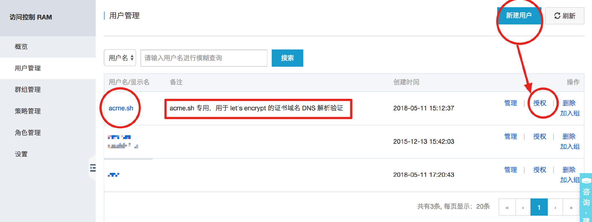
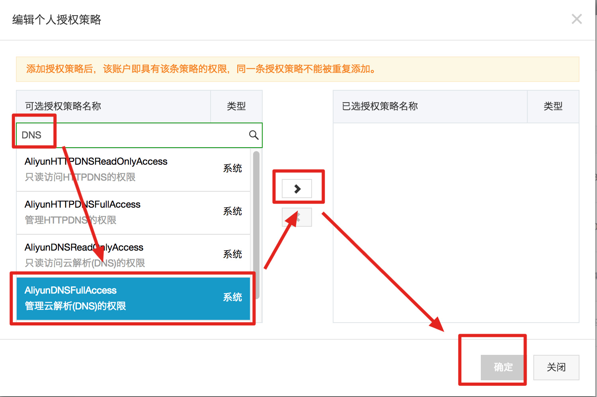
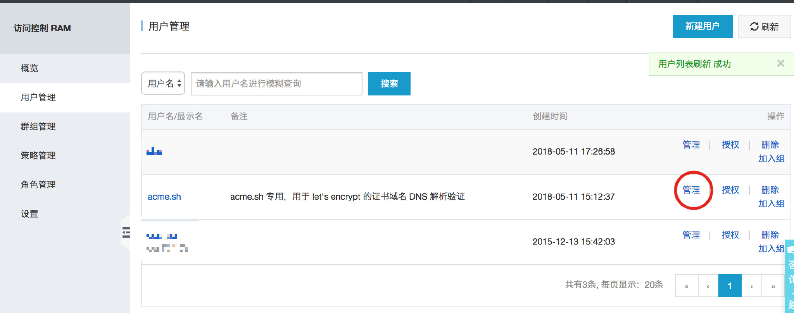
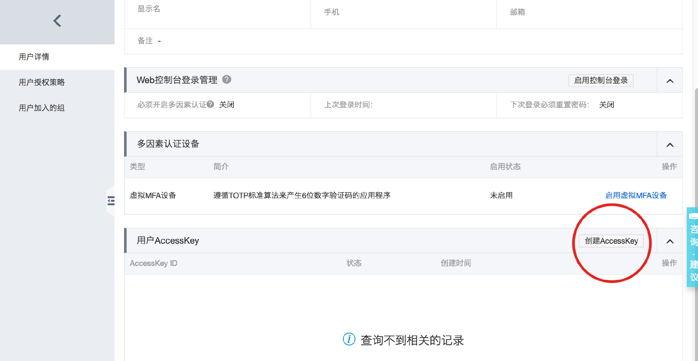
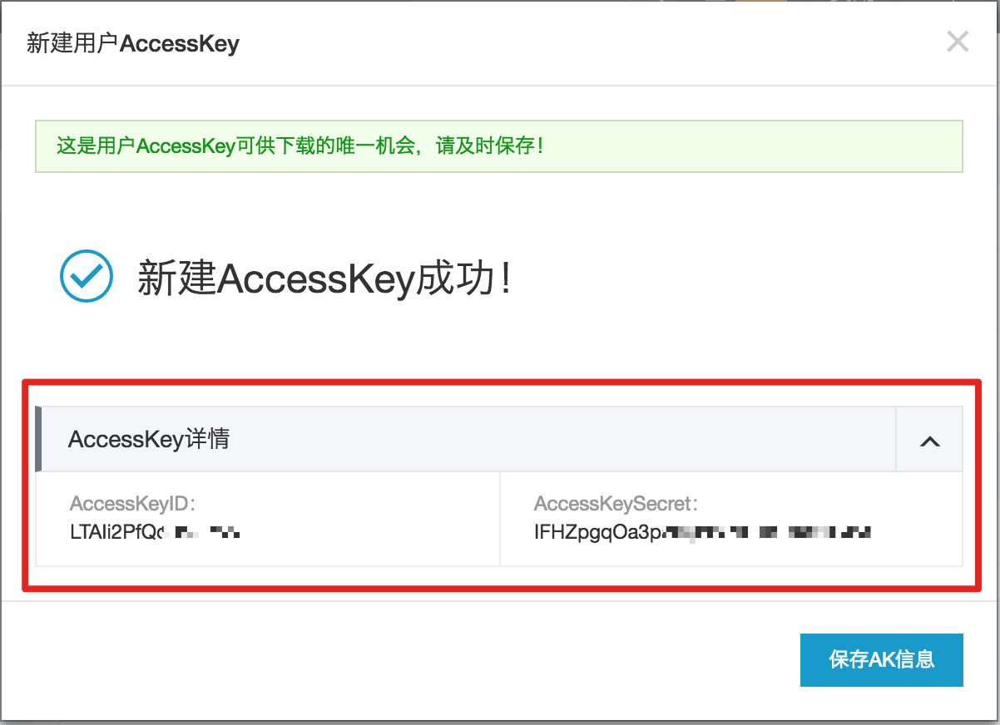
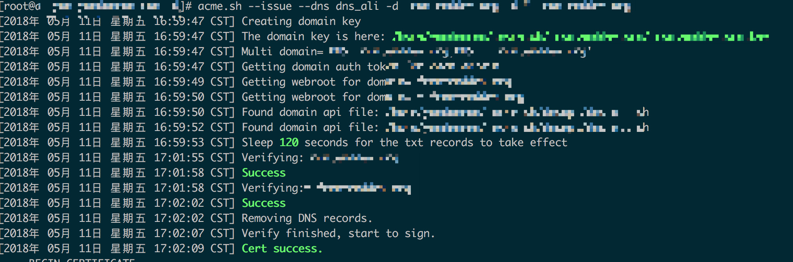
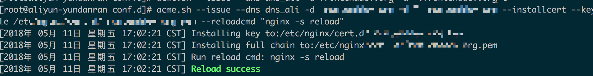

# 安装脚本
以下操作都建议使用 root 用户操作，因为需要操作 nginx。

# 安装 sh 脚本
curl https://get.acme.sh | sh

# 重载配置
source ~/.bashrc
域名验证方式
为了验证域名所有权，Let's Encrypt 支持两种方式来验证：

域名的 DNS：配置一个随机的 TXT 记录来验证
域名的访问：配置一个随机的 URL 地址来验证
作者推荐的是第一种 DNS 验证方式。

acme.sh 支持多种域名验证方式，详细列表点这里。这里以我们常用的阿里云 DNS 为例。

acme.sh 访问阿里云 DNS 是通过阿里云 DNS 公开 API 以及用户的 AK 来进行交互的。

阿里云 AK 是使用阿里云子账户来添加的。操作如下：

# 子账户

1. 打开访问控制，然后点击“用户管理”，点击“新建用户按钮”，输入用户名“acme.sh”，备注“acme.sh 专用，用于 let's encrypt 的证书域名 DNS 解析验证”;
2. 点击右边的“授权”按钮，打开授权窗口。
# 子账户权限

在授权窗口搜索“DNS”，选择“管理员解析（DNS）的权限”，即该账户就有了添加 DNS 记录和删除 DNS 记录的权限，但没有其他权限。
# 子账户密钥

点击右边的“管理”按钮进入详情页面。

点击“创建 AccessKey”，弹出创建成功对话框，对话框里显示了“AccessKeyId”和“AccessKeySecret”，保存下来，我们后续要用到。

# 添加配置
在`.bashrc` 里添加
```shell script
export Ali_Key="AccessKeyId"
export Ali_Secret="AccessKeySecret"
```
然后
```shell script
source ~/.bashrc
```

# 颁发证书
## DNS 验证
可以进行单域名、多域名、泛域名进行颁发。
```shell script
acme.sh --issue --dns dns_ali -d ydr.me -d *.ydr.me
```
这里会进行域名的 DNS 验证，中间会等待 120 秒来验证正确性，验证成功后会有成功标记。

该命令执行后，会在计划表里添加计划。
```shell script
crontab -l
```
该命令可以查看到。

# 分配给 nginx
颁发证书并且将证书安装到指定位置，并最后重启 nginx。
```shell script
acme.sh --issue --dns dns_ali -d ydr.me -d *.ydr.me\
--installcert\
--key-file /etc/nginx/cert.d/ydr.me.key\
--fullchain-file /etc/nginx/cert.d/ydr.me.pem\
--reloadcmd "nginx -s reload"
```


[原地址](https://f-e-d.club/topic/use-acme-sh-deployment-let-s-encrypt-by-ali-cloud-dns-generic-domain-https-authentication.article)
