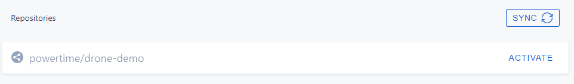

# 1. 什么是Drone?

Drone是面向开发团队的自助式持续集成平台（自动化软件构建和测试，CI/CD）。

> Drone CI 是一套持续集成和构建工具，主要利用 Docker 容器帮助完成部署任务，凭借 Docker 的跨平台能力支持 Drone CI 可以运行在各种平台，更支持大多数主流源码管理平台。
>
> Drone CI 基于 Go 语言编写，非常高效和轻型，而且有很强可扩展性，它**完全开源和免费，**可以部署在内网环境里面。当然你也可以使用他们家的提供的[企业服务](https://drone.io/enterprise/)。
>
> Drone CI 采用 Master/Slave 主从架构的分布式设计，一个 Drone CI 包含一个 Server 作为 Master 节点，而 Runner 作为 Slave 节点可以分布在不同的机器或者容器中，Server/Runner 彼此之间通过 RPC 通讯。
>
> Server 节点负责接收 Webhoot 的请求，与 Runner 节点通讯并分配任务。
>
> Runner 则负责运行任务，Runner 目前分为6种，分别是[`Docker Runner`](https://docs.drone.io/runner/docker/overview/)，[`Exec Runner`](https://docs.drone.io/runner/exec/overview/)，[`Kubernetes Runner`](https://docs.drone.io/runner/kubernetes/overview/)，[`SSH Runner`](https://docs.drone.io/runner/ssh/overview/)、[`Digital Ocean Runner`](https://docs.drone.io/runner/digitalocean/overview/)和[`Macstadium Runner`](https://docs.drone.io/runner/macstadium/overview/)。


> 被分配到 Docker Runner 的任务会在 Docker 容器中运行，而一些不能在 Docker 容器中运行的特殊任务则可以用其他 Runner 运行，例如 Exec Runner, 可以直接调用命令在系统中运行任务。


# 2. Drone-Server安装

如果要安装Server端需要先选择您使用的代码管理工具，目前Drone支持的代码管理工具有6种：

1. [Github](https://docs.drone.io/server/provider/github/)
2. [Gitlab](https://docs.drone.io/server/provider/gitlab/)
3. [Gogs](https://docs.drone.io/server/provider/gogs/)
4. [Gitea](https://docs.drone.io/server/provider/gitea/)
5. [Bitbucket Cloud](https://docs.drone.io/server/provider/bitbucket-cloud/)
6. [Bitbucket Server](https://docs.drone.io/server/provider/bitbucket-server/)

本文使用`Gitea`作为代码管理工具。使用`Docker`安装：

```shell
docker run \
  --volume=/mnt/drone:/data \
  --env=DRONE_GITEA_SERVER=http://gitea.xa \
  --env=DRONE_GITEA_CLIENT_ID=eacb546f-1284-49de-a7c6-cd44eda0891c \
  --env=DRONE_GITEA_CLIENT_SECRET=s8tqqFKgRhFOmJrpEzS4vAl9MbvvSidtCknpXOxnxMc= \
  --env=DRONE_RPC_SECRET=ff0c3bbb1770561e9feca3cb61e8269a \
  --env=DRONE_SERVER_HOST=drone.xa \
  --env=DRONE_SERVER_PROTO=http \
  --env=DRONE_USER_CREATE=username:powertime,machine:false,admin:true \
  --publish=80:80 \
  --publish=443:443 \
  --restart=always \
  --detach=true \
  --name=drone \
  drone/drone:1
```

* `DRONE_GITEA_SERVER`： `gitea`的地址

* `DRONE_GITEA_CLIENT_ID`: 应用ID。在介绍`gitea`安装是说过。如下图【客户端ID】

  

* `DRONE_GITEA_CLIENT_SECRET`: 应用密钥。如上图【客户端密钥】。

* `DRONE_RPC_SECRET`: `drone`的服务端和客户端`RPC`通信密钥。可以通过如下命令生成。

  ```shell
  openssl rand -hex 16
  ```

* `DRONE_SERVER_HOST`: `drone`服务端的地址。

* `DRONE_SERVER_PROTO`: `drone`服务协议（`http`或者`https`）

* `DRONE_USER_CREATE`: 设定`admin`管理员用户，其中`powertime`是`gitea`中的用户，这里标识把`gitea`中的`powertime`设定为管理员。有了管理员用户才有开启[`Trusted`](https://docker-runner.docs.drone.io/configuration/steps/#privileged-mode) 的权限。有了这个权限才能把宿主机中的目录挂载到`Runner`中。

## 2.1 配置Server端

访问http://drone.xa，第一次会跳转到`gitea`的授权界面，如下：


点击【应用授权】，完成后跳转到drone页面，如下：


因为`gitea`中还没有代码仓库，所以仓库列表为空，在`gitea`中创建仓库后点击【SYNC】同步参考。

# 3. Docker Runner安装

如上所述，Runner目前分为6中，本文以`Docker Runner`为例。

```shell
docker run -d \
  -v /var/run/docker.sock:/var/run/docker.sock \
  -e DRONE_RPC_PROTO=http \
  -e DRONE_RPC_HOST=drone.xa \
  -e DRONE_RPC_SECRET=ff0c3bbb1770561e9feca3cb61e8269a \
  -e DRONE_RUNNER_CAPACITY=2 \
  -e DRONE_RUNNER_NAME=${HOSTNAME} \
  -p 3000:3000 \
  --restart always \
  --name runner \
  drone/drone-runner-docker:1
```

* `DRONE_RPC_PROTO`: `drone server`的协议（`http`或者`https`）。
* `DRONE_RPC_HOST`: drone服务地址。
* `DRONE_RUNNER_CAPACITY`:  执行的并发管道数。默认为2。
* `DRONE_RUNNER_NAME`: Runner名称。

[更多配置](https://docs.drone.io/runner/docker/configuration/reference/)

## 3.1 查看是否成功安装。

```shell
docker logs runner
```

输出如下表示安装成功

```
INFO[0000] starting the server
INFO[0000] successfully pinged the remote server 
```

# 4. 创建代码仓库并在Drone中设置

在`gitea`中创建仓库，点击【SYNC】。可以看到如下。



点击【ACTIVATE】去激活这个仓库的自动构建。


点击【ACTIVATE REPOSITORY】

配置如下：


这样Drone服务端和Runner端就配置好了。

# 5. `.drone.yml`文件编写

```yaml
kind: pipeline
type: docker
name: default

steps:
  # 编译构件java代码
  - name: build-jar
    image: maven:3.6.3-jdk-8-slim
    privileged: true
    volumes:
      - name: maven_cache
        path: /root/.m2
    commands:
      - mvn clean package -DskipTests

  # 打包docker镜像到仓库
  - name: build-img
    image: plugins/docker
    # 挂载宿主机中docker镜像私有仓库证书
    volumes:
      - name: docker-certs
        path: /etc/docker/certs.d/
    settings:
      dockerfile: Dockerfile
      tags: latest
      username:
        #from_secret: loginName
        from_secret: harbor
      password:
        #from_secret: pwd
        from_secret: harborPwd
      #repo: registry.cn-hangzhou.aliyuncs.com/zywlxh/drone-demo
      #registry: registry.cn-hangzhou.aliyuncs.com
      repo: drone-harbor.powertime.cn:444/library/drone-demo
      registry: drone-harbor.powertime.cn:444
      debug: true
#      custom_dns: [ 192.168.1.254 ]
  # 利用ssh插件部署应用到知道服务器
#  - name: deploy
#    image: appleboy/drone-ssh
#    settings:
#      host: 192.168.1.154
#      username: root
#      password: root
#      port: 22
#      script:
#        docker run -d --name drone-demo -p 9999:9999 registry.cn-hangzhou.aliyuncs.com/zywlxh/drone-demo
# 利用kubectl镜像部署镜像到k8s或者rancher
  - name: deploy-kube
    image: bitnami/kubectl
    # 挂载宿主机的kubeconfig文件到容器
    volumes:
      - name: kube-config
        path: /.kube/config
    commands:
      - kubectl apply -f kubernetes.yaml
    when:
      event: [push]
      status: [ success ]

volumes:
  # maven缓存位置
  - name: maven_cache
    host:
      path: /mnt/maven_cache
  # docker私有仓库证书位置
  - name: docker-certs
    host:
      path: /etc/docker/certs.d/
  # k8s config文件位置
  - name: kube-config
    host:
      path: /mnt/kubectl/config
```

上面的`yml`文件是构建一个`java maven`项目到`Rancher`部署的`k8`s环境。

# 6. 参考

https://xie.infoq.cn/article/b1e1aa33c5d2e7841592b2786