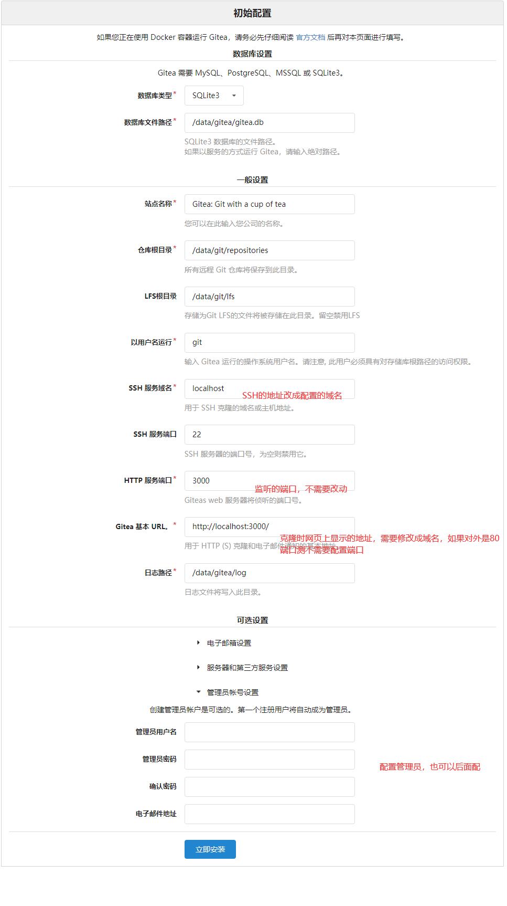
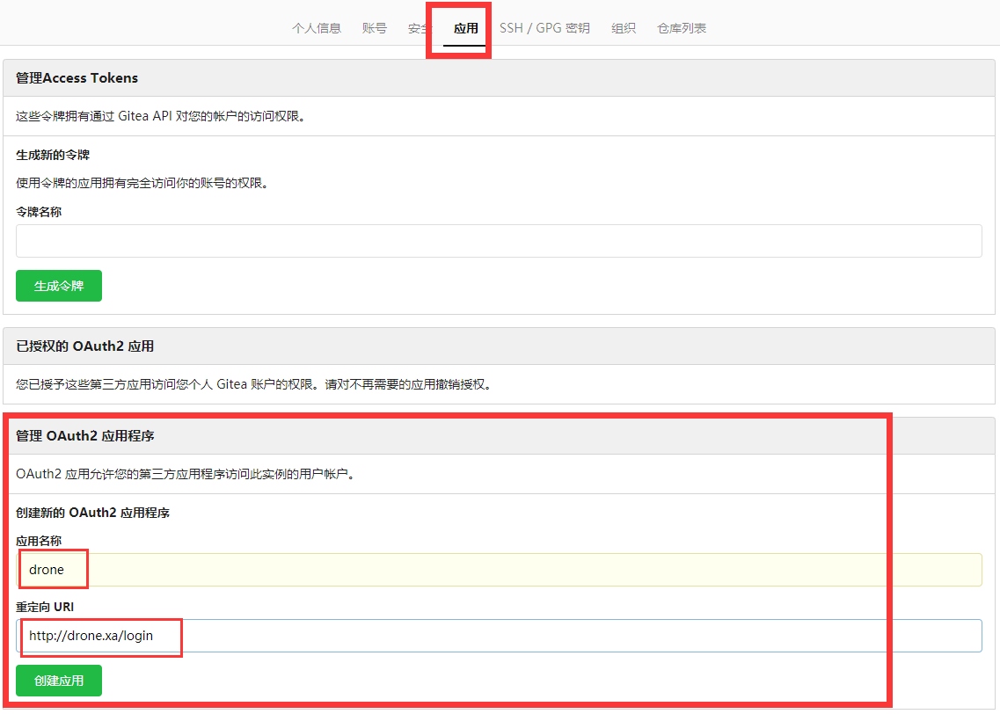
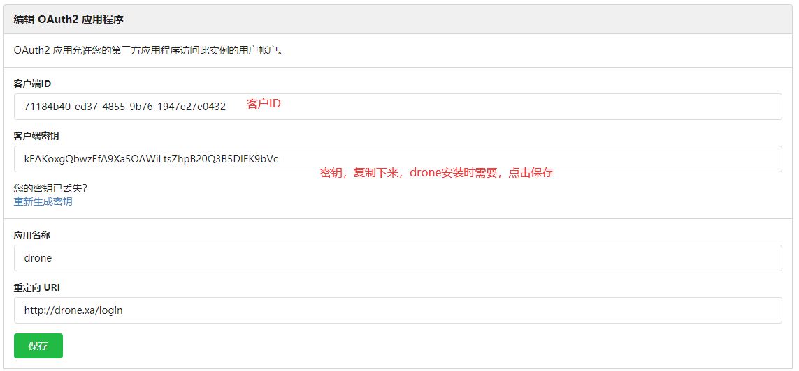

# 1. 什么是Gitea

Gitea 是一个自己托管的Git服务程序。他和GitHub, Bitbucket or Gitlab等比较类似。他是从 [Gogs](http://gogs.io/) 发展而来，不过我们已经Fork并且命名为Gitea。对于我们Fork的原因可以看 [这里](https://blog.gitea.io/2016/12/welcome-to-gitea/)。 

# 2. 安装Gitea

## 2.1 Docker命令安装

```shell
docker run \
	--volume=/mnt/gitea:/data \
	--publish=8022:22 \
	--publish=80:3000 \
	--restart=always \
	--detach=true \
	--name=gitea \
	gitea/gitea:latest
```

## 2.2 docker-compose安装

```yaml
version: "2"

networks:
  gitea:
    external: false

services:
  server:
    image: gitea/gitea:latest
    restart: always
    networks:
      - gitea
    volumes:
      - /mnt/gitea:/data
      - /etc/timezone:/etc/timezone:ro
      - /etc/localtime:/etc/localtime:ro
    ports:
      - "80:3000"
      - "8022:22"
```

# 3. 配置



配置中最主要的是【HTTP服务端口】这个是不需要配置的，【Gitea基本URL】需要配置成域名，如果是80端口可以省略端口。

# 4. 配置应用(跟Drone配合)

点击头像->【设置】->【应用】->【管理 OAuth2 应用程序】



点击【创建应用】获得，客户端ID和密钥



到此gitea就基本配置完成了。


# 5. 参考网站

https://docs.gitea.io/en-us/