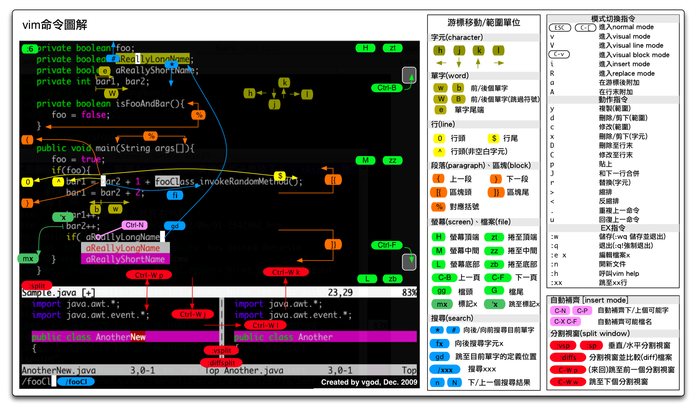

## `.vimrc`文件文章
用户的`home`目录下，也就是`~`目录下
## .vimrc为vim的配置文件
同样`neovim`也是可以使用的,neoviw的配置文件为`init.vim`,它的格式跟`.vimrc`一样

## 使用vim-plug安装插件
1. 首先安装vim-plug,linux和MacOS安装，可以看vim-plug-readme.md文件
```shell script
curl -fLo ~/.vim/autoload/plug.vim --create-dirs \
    https://raw.githubusercontent.com/junegunn/vim-plug/master/plug.vim
```
2. vim-plug安装插件需要安装git
3. 运行vim命令使用命令行模式执行`:PluginInstall`命令，插件就安装完成了。

## vim常用快捷键
### insert模式 shell命令通用
`ctrl+h`  删除字符

`ctrl+w`  删除单词

`ctrl+u`  删除一行

`ctrl+b`  前移一个字符

`ctrl+f`  后移一个字符

### insert模式
### shell
`ctrl+a` 移动到一行开始

`ctrl+e` 移动到一行末尾

`ctrl+r` 搜索历史命令

`ctrl+p` 上一个命令

`ctrl+n` 下一个命令

`ctrl+l` 清屏，替代 clear 命令

### normal模式
`gi` 快速回到刚才编辑的地方

## vim快捷键截图


